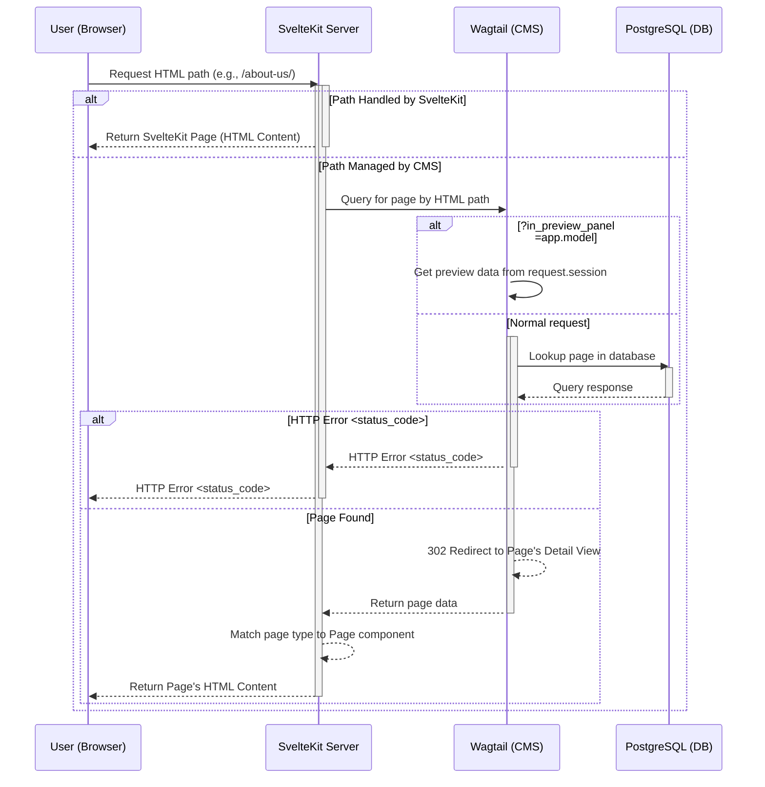

# API

This handles the API and back-office admin.

All the URLs pointing to this are prefixed by `/back`.

## Components

You'll find the following apps:

-   [people](./___project_name__snake___/apps/people) &mdash; The user model and
    authentication.

# :: IF api~~channels

-   [realtime](./___project_name__snake___/apps/realtime) &mdash; Deals with
    websockets

# :: ENDIF

# :: IF api~~wagtail

-   [cms](./___project_name__snake___/apps/cms) &mdash; All the page models for
    Wagtail

# :: ENDIF

## OpenAPI

When the app is in development mode, you can access the OpenAPI documentation at
`/back/api/schema/redoc/`.

This documentation is auto-generated using
[drf-spectacular](https://drf-spectacular.readthedocs.io/en/latest/). As you
create more APIs, make sure that they render nicely in OpenAPI format.

# :: IF api~~wagtail

## Wagtail

Wagtail is being used headless using
[Wagtail API v2](https://docs.wagtail.org/en/stable/advanced_topics/api/v2/usage.html).
A default configuration has been provided for you inside the
[front](</front/src/routes/(cms)/>) folder as a catch-all route which will serve
the pages created in the Wagtail admin.

### Site settings

You will need to set the Wagtail site port to the same as your front server.
(ie. 3000 for development).

#### Wagtail page models

The flow for requesting a Wagtail page is as follows:

##### Front Page Components

SvelteKit, on receiving the page data, will match the page type to the correct
SvelteKit component as follows:

`<AppName>.<ModelName>` -> `$lib/components/<AppName>/pages<ModelName>.svelte`

Therefore, be sure to name your SvelteKit components accordingly.

##### Front StreamField Components

Similarly, SvelteKit will match the block type to the correct SvelteKit
component as follows:

`<BlockName>` -> `$lib/components/<AppName>/blocks/<BlockName>.svelte`

Therefore, be sure to name your SvelteKit components accordingly.

# :: ENDIF
