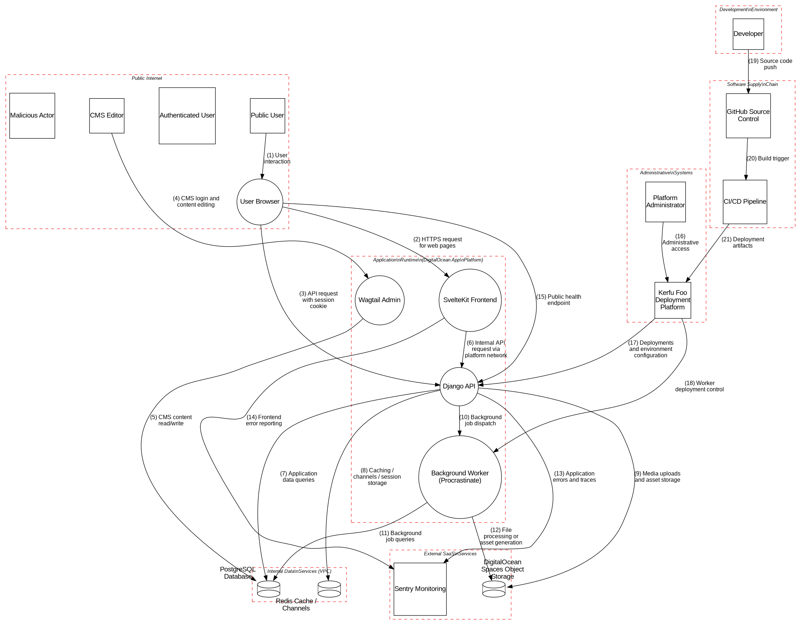

## System Description
&nbsp;

Comprehensive threat model for Model W project generator and generated projects.

This threat model covers:
1. The Model W Project Maker tool itself
2. Projects generated by the tool (Django + SvelteKit)
3. Optional components: Wagtail CMS, WebSockets (Channels), background workers
4. Infrastructure: PostgreSQL, Redis, object storage
5. CI/CD and deployment pipeline
6. Development and administrative access

Architecture:
- Public users -> Browser -> SvelteKit Frontend -> Django API
- CMS editors -> Browser -> Wagtail Admin (Django)
- Background workers (Procrastinate) -> PostgreSQL/Redis/Storage
- Observability: Sentry
- Deployment: Kerfu Foo, GitHub Actions
- Storage: PostgreSQL, Redis, DigitalOcean Spaces

&nbsp;

|Assumptions|
|-----------|
|CSRF protection enabled via Django middleware with proper token validation| 
|All external communication uses HTTPS with TLS 1.2+| 
|DigitalOcean App Platform provides network isolation and security groups| 
|Django settings use appropriate security configurations (DEBUG=False in production)| 
|SvelteKit implements proper client-side security controls| 
|Access logs are collected and monitored for suspicious activity| 
|Kerfu Foo manages deployment and secrets with secure access controls| 
|Database backups are encrypted and stored securely| 
|Public object storage (DigitalOcean Spaces) used only for non-sensitive media assets| 
|GitHub repository uses branch protection and requires code review| 
|Multi-factor authentication enabled for administrative access| 
|Redis and PostgreSQL accessible only within private network/VPC| 
|All dependencies are regularly updated and monitored for vulnerabilities| 
|Session authentication implemented using Django session cookies with secure flags| 

&nbsp;
&nbsp;
&nbsp;

## Dataflow Diagram - Level 0 DFD

&nbsp;

## Dataflows
&nbsp;

Name|From|To |Data|Protocol|Port
|:----:|:----:|:---:|:----:|:--------:|:----:|
|Dataflow(User interaction)|Actor(Public User)|Process(User Browser)|[]||-1|
|Dataflow(HTTPS request for web pages)|Process(User Browser)|Process(SvelteKit Frontend)|[]|HTTPS|443|
|Dataflow(API request with session cookie)|Process(User Browser)|Process(Django API)|User Credentials, User Session Cookie|HTTPS|443|
|Dataflow(CMS login and content editing)|Actor(CMS Editor)|Process(Wagtail Admin)|User Credentials|HTTPS|443|
|Dataflow(CMS content read/write)|Process(Wagtail Admin)|Datastore(PostgreSQL Database)|Application Content|PostgreSQL|5432|
|Dataflow(Internal API request via platform network)|Process(SvelteKit Frontend)|Process(Django API)|[]|HTTP|8000|
|Dataflow(Application data queries)|Process(Django API)|Datastore(PostgreSQL Database)|Application Content, User Profile Data|PostgreSQL|5432|
|Dataflow(Caching / channels / session storage)|Process(Django API)|Datastore(Redis Cache / Channels)|User Session Cookie|Redis|6379|
|Dataflow(Media uploads and asset storage)|Process(Django API)|Datastore(DigitalOcean Spaces Object Storage)|[]|HTTPS|443|
|Dataflow(Background job dispatch)|Process(Django API)|Process(Background Worker (Procrastinate))|[]|Procrastinate|8000|
|Dataflow(Background job queries)|Process(Background Worker (Procrastinate))|Datastore(PostgreSQL Database)|[]|PostgreSQL|5432|
|Dataflow(File processing or asset generation)|Process(Background Worker (Procrastinate))|Datastore(DigitalOcean Spaces Object Storage)|[]|HTTPS|443|
|Dataflow(Application errors and traces)|Process(Django API)|ExternalEntity(Sentry Monitoring)|Error Traces|HTTPS|443|
|Dataflow(Frontend error reporting)|Process(SvelteKit Frontend)|ExternalEntity(Sentry Monitoring)|[]|HTTPS|443|
|Dataflow(Public health endpoint)|Process(User Browser)|Process(Django API)|[]|HTTPS|443|
|Dataflow(Administrative access)|Actor(Platform Administrator)|ExternalEntity(Kerfu Foo Deployment Platform)|[]|HTTPS|443|
|Dataflow(Deployments and environment configuration)|ExternalEntity(Kerfu Foo Deployment Platform)|Process(Django API)|Database Secrets|SSH|22|
|Dataflow(Worker deployment control)|ExternalEntity(Kerfu Foo Deployment Platform)|Process(Background Worker (Procrastinate))|[]|SSH|22|
|Dataflow(Source code push)|Actor(Developer)|ExternalEntity(GitHub Source Control)|[]|Git/HTTPS|443|
|Dataflow(Build trigger)|ExternalEntity(GitHub Source Control)|ExternalEntity(CI/CD Pipeline)|[]|Webhook/HTTPS|443|
|Dataflow(Deployment artifacts)|ExternalEntity(CI/CD Pipeline)|ExternalEntity(Kerfu Foo Deployment Platform)|[]|HTTPS|443|

## Data Dictionary
&nbsp;

Name|Description|Classification
|:----:|:--------:|:----:|
|Data(User Session Cookie)|Django session ID used for authentication|Classification.SENSITIVE|
|Data(User Credentials)|Username and Password for login|Classification.SENSITIVE|
|Data(Application Content)|General CMS content and public data|Classification.PUBLIC|
|Data(User Profile Data)|Names, emails, and profile information|Classification.SENSITIVE|
|Data(Database Secrets)|Credentials used by Django to connect to Postgres/Redis|Classification.RESTRICTED|
|Data(Error Traces)|Stack traces and debug info sent to Sentry|Classification.SENSITIVE|

&nbsp;

## Potential Threats

&nbsp;
&nbsp;

**Total Threats Identified:** 307

&nbsp;
&nbsp;

  

    INP02 — Overflow Buffers
  

  <h6>Targeted Element</h6>
  
User Browser

  <h6>Severity</h6>
  
Very High

  <h6>Mitigation</h6>
  
Use a language or compiler that performs automatic bounds checking. Use secure functions not vulnerable to buffer overflow. If you have to use dangerous functions, make sure that you do boundary checking. Compiler-based canary mechanisms such as StackGuard, ProPolice and the Microsoft Visual Studio /GS flag. Unless this provides automatic bounds checking, it is not a complete solution. Use OS-level preventative functionality. Not a complete solution. Utilize static source code analysis tools to identify potential buffer overflow weaknesses in the software.

  

    AA01 — Authentication Abuse/ByPass
  

  <h6>Targeted Element</h6>
  
User Browser

  <h6>Severity</h6>
  
Medium

  <h6>Mitigation</h6>
  
Use strong authentication and authorization mechanisms. A proven protocol is OAuth 2.0, which enables a third-party application to obtain limited access to an API.

  

    DE02 — Double Encoding
  

  <h6>Targeted Element</h6>
  
User Browser

  <h6>Severity</h6>
  
Medium

  <h6>Mitigation</h6>
  
Assume all input is malicious. Create a white list that defines all valid input to the software system based on the requirements specifications. Input that does not match against the white list should not be permitted to enter into the system. Test your decoding process against malicious input. Be aware of the threat of alternative method of data encoding and obfuscation technique such as IP address encoding. When client input is required from web-based forms, avoid using the GET method to submit data, as the method causes the form data to be appended to the URL and is easily manipulated. Instead, use the POST method whenever possible. Any security checks should occur after the data has been decoded and validated as correct data format. Do not repeat decoding process, if bad character are left after decoding process, treat the data as suspicious, and fail the validation process.Refer to the RFCs to safely decode URL. Regular expression can be used to match safe URL patterns. However, that may discard valid URL requests if the regular expression is too restrictive. There are tools to scan HTTP requests to the server for valid URL such as URLScan from Microsoft (http://www.microsoft.com/technet/security/tools/urlscan.mspx).

  

    AC01 — Privilege Abuse
  

  <h6>Targeted Element</h6>
  
User Browser

  <h6>Severity</h6>
  
Medium

  <h6>Mitigation</h6>
  
Use strong authentication and authorization mechanisms. A proven protocol is OAuth 2.0, which enables a third-party application to obtain limited access to an API.

  

    INP07 — Buffer Manipulation
  

  <h6>Targeted Element</h6>
  
User Browser

  <h6>Severity</h6>
  
Very High

  <h6>Mitigation</h6>
  
To help protect an application from buffer manipulation attacks, a number of potential mitigations can be leveraged. Before starting the development of the application, consider using a code language (e.g., Java) or compiler that limits the ability of developers to act beyond the bounds of a buffer. If the chosen language is susceptible to buffer related issues (e.g., C) then consider using secure functions instead of those vulnerable to buffer manipulations. If a potentially dangerous function must be used, make sure that proper boundary checking is performed. Additionally, there are often a number of compiler-based mechanisms (e.g., StackGuard, ProPolice and the Microsoft Visual Studio /GS flag) that can help identify and protect against potential buffer issues. Finally, there may be operating system level preventative functionality that can be applied.

  

    DO01 — Flooding
  

  <h6>Targeted Element</h6>
  
User Browser

  <h6>Severity</h6>
  
Medium

  <h6>Mitigation</h6>
  
Ensure that protocols have specific limits of scale configured. Specify expectations for capabilities and dictate which behaviors are acceptable when resource allocation reaches limits. Uniformly throttle all requests in order to make it more difficult to consume resources more quickly than they can again be freed.

  

    DO02 — Excessive Allocation
  

  <h6>Targeted Element</h6>
  
User Browser

  <h6>Severity</h6>
  
Medium

  <h6>Mitigation</h6>
  
Limit the amount of resources that are accessible to unprivileged users. Assume all input is malicious. Consider all potentially relevant properties when validating input. Consider uniformly throttling all requests in order to make it more difficult to consume resources more quickly than they can again be freed. Use resource-limiting settings, if possible.

  

    INP08 — Format String Injection
  

  <h6>Targeted Element</h6>
  
User Browser

  <h6>Severity</h6>
  
High

  <h6>Mitigation</h6>
  
Limit the usage of formatting string functions. Strong input validation - All user-controllable input must be validated and filtered for illegal formatting characters.

  

    INP12 — Client-side Injection-induced Buffer Overflow
  

  <h6>Targeted Element</h6>
  
User Browser

  <h6>Severity</h6>
  
High

  <h6>Mitigation</h6>
  
The client software should not install untrusted code from a non-authenticated server. The client software should have the latest patches and should be audited for vulnerabilities before being used to communicate with potentially hostile servers. Perform input validation for length of buffer inputs. Use a language or compiler that performs automatic bounds checking. Use an abstraction library to abstract away risky APIs. Not a complete solution. Compiler-based canary mechanisms such as StackGuard, ProPolice and the Microsoft Visual Studio /GS flag. Unless this provides automatic bounds checking, it is not a complete solution. Ensure all buffer uses are consistently bounds-checked. Use OS-level preventative functionality. Not a complete solution.

  

    INP13 — Command Delimiters
  

  <h6>Targeted Element</h6>
  
User Browser

  <h6>Severity</h6>
  
High

  <h6>Mitigation</h6>
  
Design: Perform whitelist validation against a positive specification for command length, type, and parameters.Design: Limit program privileges, so if commands circumvent program input validation or filter routines then commands do not running under a privileged accountImplementation: Perform input validation for all remote content.Implementation: Use type conversions such as JDBC prepared statements.

  

    INP14 — Input Data Manipulation
  

  <h6>Targeted Element</h6>
  
User Browser

  <h6>Severity</h6>
  
Medium

  <h6>Mitigation</h6>
  
Validation of user input for type, length, data-range, format, etc.

  

    CR03 — Dictionary-based Password Attack
  

  <h6>Targeted Element</h6>
  
User Browser

  <h6>Severity</h6>
  
High

  <h6>Mitigation</h6>
  
Create a strong password policy and ensure that your system enforces this policy.Implement an intelligent password throttling mechanism. Care must be taken to assure that these mechanisms do not excessively enable account lockout attacks such as CAPEC-02.

  

    AA02 — Principal Spoof
  

  <h6>Targeted Element</h6>
  
User Browser

  <h6>Severity</h6>
  
Medium

  <h6>Mitigation</h6>
  
Employ robust authentication processes (e.g., multi-factor authentication).

  

    INP20 — iFrame Overlay
  

  <h6>Targeted Element</h6>
  
User Browser

  <h6>Severity</h6>
  
High

  <h6>Mitigation</h6>
  
Configuration: Disable iFrames in the Web browser.Operation: When maintaining an authenticated session with a privileged target system, do not use the same browser to navigate to unfamiliar sites to perform other activities. Finish working with the target system and logout first before proceeding to other tasks.Operation: If using the Firefox browser, use the NoScript plug-in that will help forbid iFrames.

  

    INP23 — File Content Injection
  

  <h6>Targeted Element</h6>
  
User Browser

  <h6>Severity</h6>
  
Very High

  <h6>Mitigation</h6>
  
Design: Enforce principle of least privilegeDesign: Validate all input for content including files. Ensure that if files and remote content must be accepted that once accepted, they are placed in a sandbox type location so that lower assurance clients cannot write up to higher assurance processes (like Web server processes for example)Design: Execute programs with constrained privileges, so parent process does not open up further vulnerabilities. Ensure that all directories, temporary directories and files, and memory are executing with limited privileges to protect against remote execution.Design: Proxy communication to host, so that communications are terminated at the proxy, sanitizing the requests before forwarding to server host.Implementation: Virus scanning on hostImplementation: Host integrity monitoring for critical files, directories, and processes. The goal of host integrity monitoring is to be aware when a security issue has occurred so that incident response and other forensic activities can begin.

  

    AC12 — Privilege Escalation
  

  <h6>Targeted Element</h6>
  
User Browser

  <h6>Severity</h6>
  
High

  <h6>Mitigation</h6>
  
Very carefully manage the setting, management, and handling of privileges. Explicitly manage trust zones in the software. Follow the principle of least privilege when assigning access rights to entities in a software system. Implement separation of privilege - Require multiple conditions to be met before permitting access to a system resource.

  

    AC13 — Hijacking a privileged process
  

  <h6>Targeted Element</h6>
  
User Browser

  <h6>Severity</h6>
  
Medium

  <h6>Mitigation</h6>
  
Very carefully manage the setting, management, and handling of privileges. Explicitly manage trust zones in the software. Follow the principle of least privilege when assigning access rights to entities in a software system. Implement separation of privilege - Require multiple conditions to be met before permitting access to a system resource.

  

    AC14 — Catching exception throw/signal from privileged block
  

  <h6>Targeted Element</h6>
  
User Browser

  <h6>Severity</h6>
  
Very High

  <h6>Mitigation</h6>
  
Application Architects must be careful to design callback, signal, and similar asynchronous constructs such that they shed excess privilege prior to handing control to user-written (thus untrusted) code.Application Architects must be careful to design privileged code blocks such that upon return (successful, failed, or unpredicted) that privilege is shed prior to leaving the block/scope.

  

    INP24 — Filter Failure through Buffer Overflow
  

  <h6>Targeted Element</h6>
  
User Browser

  <h6>Severity</h6>
  
High

  <h6>Mitigation</h6>
  
Make sure that ANY failure occurring in the filtering or input validation routine is properly handled and that offending input is NOT allowed to go through. Basically make sure that the vault is closed when failure occurs.Pre-design: Use a language or compiler that performs automatic bounds checking.Pre-design through Build: Compiler-based canary mechanisms such as StackGuard, ProPolice and the Microsoft Visual Studio /GS flag. Unless this provides automatic bounds checking, it is not a complete solution.Operational: Use OS-level preventative functionality. Not a complete solution.Design: Use an abstraction library to abstract away risky APIs. Not a complete solution.

  

    INP25 — Resource Injection
  

  <h6>Targeted Element</h6>
  
User Browser

  <h6>Severity</h6>
  
High

  <h6>Mitigation</h6>
  
Ensure all input content that is delivered to client is sanitized against an acceptable content specification.Perform input validation for all content.Enforce regular patching of software.

  

    INP26 — Code Injection
  

  <h6>Targeted Element</h6>
  
User Browser

  <h6>Severity</h6>
  
High

  <h6>Mitigation</h6>
  
Utilize strict type, character, and encoding enforcementEnsure all input content that is delivered to client is sanitized against an acceptable content specification.Perform input validation for all content.Enforce regular patching of software.

  

    INP27 — XSS Targeting HTML Attributes
  

  <h6>Targeted Element</h6>
  
User Browser

  <h6>Severity</h6>
  
Medium

  <h6>Mitigation</h6>
  
Design: Use libraries and templates that minimize unfiltered input.Implementation: Normalize, filter and white list all input including that which is not expected to have any scripting content.Implementation: The victim should configure the browser to minimize active content from untrusted sources.

  

    INP28 — XSS Targeting URI Placeholders
  

  <h6>Targeted Element</h6>
  
User Browser

  <h6>Severity</h6>
  
High

  <h6>Mitigation</h6>
  
Design: Use browser technologies that do not allow client side scripting.Design: Utilize strict type, character, and encoding enforcement.Implementation: Ensure all content that is delivered to client is sanitized against an acceptable content specification.Implementation: Ensure all content coming from the client is using the same encoding; if not, the server-side application must canonicalize the data before applying any filtering.Implementation: Perform input validation for all remote content, including remote and user-generated contentImplementation: Perform output validation for all remote content.Implementation: Disable scripting languages such as JavaScript in browserImplementation: Patching software. There are many attack vectors for XSS on the client side and the server side. Many vulnerabilities are fixed in service packs for browser, web servers, and plug in technologies, staying current on patch release that deal with XSS countermeasures mitigates this.

  

    INP29 — XSS Using Doubled Characters
  

  <h6>Targeted Element</h6>
  
User Browser

  <h6>Severity</h6>
  
Medium

  <h6>Mitigation</h6>
  
Design: Use libraries and templates that minimize unfiltered input.Implementation: Normalize, filter and sanitize all user supplied fields.Implementation: The victim should configure the browser to minimize active content from untrusted sources.

  

    INP30 — XSS Using Invalid Characters
  

  <h6>Targeted Element</h6>
  
User Browser

  <h6>Severity</h6>
  
Medium

  <h6>Mitigation</h6>
  
Design: Use libraries and templates that minimize unfiltered input.Implementation: Normalize, filter and white list any input that will be included in any subsequent web pages or back end operations.Implementation: The victim should configure the browser to minimize active content from untrusted sources.

  

    INP31 — Command Injection
  

  <h6>Targeted Element</h6>
  
User Browser

  <h6>Severity</h6>
  
High

  <h6>Mitigation</h6>
  
All user-controllable input should be validated and filtered for potentially unwanted characters. Whitelisting input is desired, but if a blacklisting approach is necessary, then focusing on command related terms and delimiters is necessary.Input should be encoded prior to use in commands to make sure command related characters are not treated as part of the command. For example, quotation characters may need to be encoded so that the application does not treat the quotation as a delimiter.Input should be parameterized, or restricted to data sections of a command, thus removing the chance that the input will be treated as part of the command itself.

  

    INP32 — XML Injection
  

  <h6>Targeted Element</h6>
  
User Browser

  <h6>Severity</h6>
  
High

  <h6>Mitigation</h6>
  
Strong input validation - All user-controllable input must be validated and filtered for illegal characters as well as content that can be interpreted in the context of an XML data or a query. Use of custom error pages - Attackers can glean information about the nature of queries from descriptive error messages. Input validation must be coupled with customized error pages that inform about an error without disclosing information about the database or application.

  

    INP33 — Remote Code Inclusion
  

  <h6>Targeted Element</h6>
  
User Browser

  <h6>Severity</h6>
  
High

  <h6>Mitigation</h6>
  
Minimize attacks by input validation and sanitization of any user data that will be used by the target application to locate a remote file to be included.

  

    INP35 — Leverage Alternate Encoding
  

  <h6>Targeted Element</h6>
  
User Browser

  <h6>Severity</h6>
  
High

  <h6>Mitigation</h6>
  
Assume all input might use an improper representation. Use canonicalized data inside the application; all data must be converted into the representation used inside the application (UTF-8, UTF-16, etc.)Assume all input is malicious. Create a white list that defines all valid input to the software system based on the requirements specifications. Input that does not match against the white list should not be permitted to enter into the system. Test your decoding process against malicious input.

  

    AC15 — Schema Poisoning
  

  <h6>Targeted Element</h6>
  
User Browser

  <h6>Severity</h6>
  
High

  <h6>Mitigation</h6>
  
Design: Protect the schema against unauthorized modification.Implementation: For applications that use a known schema, use a local copy or a known good repository instead of the schema reference supplied in the schema document.Implementation: For applications that leverage remote schemas, use the HTTPS protocol to prevent modification of traffic in transit and to avoid unauthorized modification.

  

    AC18 — Session Hijacking - ClientSide
  

  <h6>Targeted Element</h6>
  
User Browser

  <h6>Severity</h6>
  
Very High

  <h6>Mitigation</h6>
  
Properly encrypt and sign identity tokens in transit, and use industry standard session key generation mechanisms that utilize high amount of entropy to generate the session key. Many standard web and application servers will perform this task on your behalf. Utilize a session timeout for all sessions. If the user does not explicitly logout, terminate their session after this period of inactivity. If the user logs back in then a new session key should be generated.

  

    INP41 — Argument Injection
  

  <h6>Targeted Element</h6>
  
User Browser

  <h6>Severity</h6>
  
High

  <h6>Mitigation</h6>
  
Design: Do not program input values directly on command shell, instead treat user input as guilty until proven innocent. Build a function that takes user input and converts it to applications specific types and values, stripping or filtering out all unauthorized commands and characters in the process.Design: Limit program privileges, so if metacharacters or other methods circumvent program input validation routines and shell access is attained then it is not running under a privileged account. chroot jails create a sandbox for the application to execute in, making it more difficult for an attacker to elevate privilege even in the case that a compromise has occurred.Implementation: Implement an audit log that is written to a separate host, in the event of a compromise the audit log may be able to provide evidence and details of the compromise.

  

    AC20 — Reusing Session IDs (aka Session Replay) - ClientSide
  

  <h6>Targeted Element</h6>
  
User Browser

  <h6>Severity</h6>
  
High

  <h6>Mitigation</h6>
  
Always invalidate a session ID after the user logout.Setup a session time out for the session IDs.Protect the communication between the client and server. For instance it is best practice to use SSL to mitigate man in the middle attack.Do not code send session ID with GET method, otherwise the session ID will be copied to the URL. In general avoid writing session IDs in the URLs. URLs can get logged in log files, which are vulnerable to an attacker.Encrypt the session data associated with the session ID.Use multifactor authentication.

  

    AC21 — Cross Site Request Forgery
  

  <h6>Targeted Element</h6>
  
User Browser

  <h6>Severity</h6>
  
Very High

  <h6>Mitigation</h6>
  
Use cryptographic tokens to associate a request with a specific action. The token can be regenerated at every request so that if a request with an invalid token is encountered, it can be reliably discarded. The token is considered invalid if it arrived with a request other than the action it was supposed to be associated with.Although less reliable, the use of the optional HTTP Referrer header can also be used to determine whether an incoming request was actually one that the user is authorized for, in the current context.Additionally, the user can also be prompted to confirm an action every time an action concerning potentially sensitive data is invoked. This way, even if the attacker manages to get the user to click on a malicious link and request the desired action, the user has a chance to recover by denying confirmation. This solution is also implicitly tied to using a second factor of authentication before performing such actions.In general, every request must be checked for the appropriate authentication token as well as authorization in the current session context.

  

    INP02 — Overflow Buffers
  

  <h6>Targeted Element</h6>
  
SvelteKit Frontend

  <h6>Severity</h6>
  
Very High

  <h6>Mitigation</h6>
  
Use a language or compiler that performs automatic bounds checking. Use secure functions not vulnerable to buffer overflow. If you have to use dangerous functions, make sure that you do boundary checking. Compiler-based canary mechanisms such as StackGuard, ProPolice and the Microsoft Visual Studio /GS flag. Unless this provides automatic bounds checking, it is not a complete solution. Use OS-level preventative functionality. Not a complete solution. Utilize static source code analysis tools to identify potential buffer overflow weaknesses in the software.

  

    AA01 — Authentication Abuse/ByPass
  

  <h6>Targeted Element</h6>
  
SvelteKit Frontend

  <h6>Severity</h6>
  
Medium

  <h6>Mitigation</h6>
  
Use strong authentication and authorization mechanisms. A proven protocol is OAuth 2.0, which enables a third-party application to obtain limited access to an API.

  

    DE02 — Double Encoding
  

  <h6>Targeted Element</h6>
  
SvelteKit Frontend

  <h6>Severity</h6>
  
Medium

  <h6>Mitigation</h6>
  
Assume all input is malicious. Create a white list that defines all valid input to the software system based on the requirements specifications. Input that does not match against the white list should not be permitted to enter into the system. Test your decoding process against malicious input. Be aware of the threat of alternative method of data encoding and obfuscation technique such as IP address encoding. When client input is required from web-based forms, avoid using the GET method to submit data, as the method causes the form data to be appended to the URL and is easily manipulated. Instead, use the POST method whenever possible. Any security checks should occur after the data has been decoded and validated as correct data format. Do not repeat decoding process, if bad character are left after decoding process, treat the data as suspicious, and fail the validation process.Refer to the RFCs to safely decode URL. Regular expression can be used to match safe URL patterns. However, that may discard valid URL requests if the regular expression is too restrictive. There are tools to scan HTTP requests to the server for valid URL such as URLScan from Microsoft (http://www.microsoft.com/technet/security/tools/urlscan.mspx).

  

    AC01 — Privilege Abuse
  

  <h6>Targeted Element</h6>
  
SvelteKit Frontend

  <h6>Severity</h6>
  
Medium

  <h6>Mitigation</h6>
  
Use strong authentication and authorization mechanisms. A proven protocol is OAuth 2.0, which enables a third-party application to obtain limited access to an API.

  

    INP07 — Buffer Manipulation
  

  <h6>Targeted Element</h6>
  
SvelteKit Frontend

  <h6>Severity</h6>
  
Very High

  <h6>Mitigation</h6>
  
To help protect an application from buffer manipulation attacks, a number of potential mitigations can be leveraged. Before starting the development of the application, consider using a code language (e.g., Java) or compiler that limits the ability of developers to act beyond the bounds of a buffer. If the chosen language is susceptible to buffer related issues (e.g., C) then consider using secure functions instead of those vulnerable to buffer manipulations. If a potentially dangerous function must be used, make sure that proper boundary checking is performed. Additionally, there are often a number of compiler-based mechanisms (e.g., StackGuard, ProPolice and the Microsoft Visual Studio /GS flag) that can help identify and protect against potential buffer issues. Finally, there may be operating system level preventative functionality that can be applied.

  

    DO01 — Flooding
  

  <h6>Targeted Element</h6>
  
SvelteKit Frontend

  <h6>Severity</h6>
  
Medium

  <h6>Mitigation</h6>
  
Ensure that protocols have specific limits of scale configured. Specify expectations for capabilities and dictate which behaviors are acceptable when resource allocation reaches limits. Uniformly throttle all requests in order to make it more difficult to consume resources more quickly than they can again be freed.

  

    DO02 — Excessive Allocation
  

  <h6>Targeted Element</h6>
  
SvelteKit Frontend

  <h6>Severity</h6>
  
Medium

  <h6>Mitigation</h6>
  
Limit the amount of resources that are accessible to unprivileged users. Assume all input is malicious. Consider all potentially relevant properties when validating input. Consider uniformly throttling all requests in order to make it more difficult to consume resources more quickly than they can again be freed. Use resource-limiting settings, if possible.

  

    INP08 — Format String Injection
  

  <h6>Targeted Element</h6>
  
SvelteKit Frontend

  <h6>Severity</h6>
  
High

  <h6>Mitigation</h6>
  
Limit the usage of formatting string functions. Strong input validation - All user-controllable input must be validated and filtered for illegal formatting characters.

  

    INP12 — Client-side Injection-induced Buffer Overflow
  

  <h6>Targeted Element</h6>
  
SvelteKit Frontend

  <h6>Severity</h6>
  
High

  <h6>Mitigation</h6>
  
The client software should not install untrusted code from a non-authenticated server. The client software should have the latest patches and should be audited for vulnerabilities before being used to communicate with potentially hostile servers. Perform input validation for length of buffer inputs. Use a language or compiler that performs automatic bounds checking. Use an abstraction library to abstract away risky APIs. Not a complete solution. Compiler-based canary mechanisms such as StackGuard, ProPolice and the Microsoft Visual Studio /GS flag. Unless this provides automatic bounds checking, it is not a complete solution. Ensure all buffer uses are consistently bounds-checked. Use OS-level preventative functionality. Not a complete solution.

  

    INP13 — Command Delimiters
  

  <h6>Targeted Element</h6>
  
SvelteKit Frontend

  <h6>Severity</h6>
  
High

  <h6>Mitigation</h6>
  
Design: Perform whitelist validation against a positive specification for command length, type, and parameters.Design: Limit program privileges, so if commands circumvent program input validation or filter routines then commands do not running under a privileged accountImplementation: Perform input validation for all remote content.Implementation: Use type conversions such as JDBC prepared statements.

  

    INP14 — Input Data Manipulation
  

  <h6>Targeted Element</h6>
  
SvelteKit Frontend

  <h6>Severity</h6>
  
Medium

  <h6>Mitigation</h6>
  
Validation of user input for type, length, data-range, format, etc.

  

    CR03 — Dictionary-based Password Attack
  

  <h6>Targeted Element</h6>
  
SvelteKit Frontend

  <h6>Severity</h6>
  
High

  <h6>Mitigation</h6>
  
Create a strong password policy and ensure that your system enforces this policy.Implement an intelligent password throttling mechanism. Care must be taken to assure that these mechanisms do not excessively enable account lockout attacks such as CAPEC-02.

  

    AA02 — Principal Spoof
  

  <h6>Targeted Element</h6>
  
SvelteKit Frontend

  <h6>Severity</h6>
  
Medium

  <h6>Mitigation</h6>
  
Employ robust authentication processes (e.g., multi-factor authentication).

  

    INP20 — iFrame Overlay
  

  <h6>Targeted Element</h6>
  
SvelteKit Frontend

  <h6>Severity</h6>
  
High

  <h6>Mitigation</h6>
  
Configuration: Disable iFrames in the Web browser.Operation: When maintaining an authenticated session with a privileged target system, do not use the same browser to navigate to unfamiliar sites to perform other activities. Finish working with the target system and logout first before proceeding to other tasks.Operation: If using the Firefox browser, use the NoScript plug-in that will help forbid iFrames.

  

    INP23 — File Content Injection
  

  <h6>Targeted Element</h6>
  
SvelteKit Frontend

  <h6>Severity</h6>
  
Very High

  <h6>Mitigation</h6>
  
Design: Enforce principle of least privilegeDesign: Validate all input for content including files. Ensure that if files and remote content must be accepted that once accepted, they are placed in a sandbox type location so that lower assurance clients cannot write up to higher assurance processes (like Web server processes for example)Design: Execute programs with constrained privileges, so parent process does not open up further vulnerabilities. Ensure that all directories, temporary directories and files, and memory are executing with limited privileges to protect against remote execution.Design: Proxy communication to host, so that communications are terminated at the proxy, sanitizing the requests before forwarding to server host.Implementation: Virus scanning on hostImplementation: Host integrity monitoring for critical files, directories, and processes. The goal of host integrity monitoring is to be aware when a security issue has occurred so that incident response and other forensic activities can begin.

  

    AC12 — Privilege Escalation
  

  <h6>Targeted Element</h6>
  
SvelteKit Frontend

  <h6>Severity</h6>
  
High

  <h6>Mitigation</h6>
  
Very carefully manage the setting, management, and handling of privileges. Explicitly manage trust zones in the software. Follow the principle of least privilege when assigning access rights to entities in a software system. Implement separation of privilege - Require multiple conditions to be met before permitting access to a system resource.

  

    AC13 — Hijacking a privileged process
  

  <h6>Targeted Element</h6>
  
SvelteKit Frontend

  <h6>Severity</h6>
  
Medium

  <h6>Mitigation</h6>
  
Very carefully manage the setting, management, and handling of privileges. Explicitly manage trust zones in the software. Follow the principle of least privilege when assigning access rights to entities in a software system. Implement separation of privilege - Require multiple conditions to be met before permitting access to a system resource.

  

    AC14 — Catching exception throw/signal from privileged block
  

  <h6>Targeted Element</h6>
  
SvelteKit Frontend

  <h6>Severity</h6>
  
Very High

  <h6>Mitigation</h6>
  
Application Architects must be careful to design callback, signal, and similar asynchronous constructs such that they shed excess privilege prior to handing control to user-written (thus untrusted) code.Application Architects must be careful to design privileged code blocks such that upon return (successful, failed, or unpredicted) that privilege is shed prior to leaving the block/scope.

  

    INP24 — Filter Failure through Buffer Overflow
  

  <h6>Targeted Element</h6>
  
SvelteKit Frontend

  <h6>Severity</h6>
  
High

  <h6>Mitigation</h6>
  
Make sure that ANY failure occurring in the filtering or input validation routine is properly handled and that offending input is NOT allowed to go through. Basically make sure that the vault is closed when failure occurs.Pre-design: Use a language or compiler that performs automatic bounds checking.Pre-design through Build: Compiler-based canary mechanisms such as StackGuard, ProPolice and the Microsoft Visual Studio /GS flag. Unless this provides automatic bounds checking, it is not a complete solution.Operational: Use OS-level preventative functionality. Not a complete solution.Design: Use an abstraction library to abstract away risky APIs. Not a complete solution.

  

    INP25 — Resource Injection
  

  <h6>Targeted Element</h6>
  
SvelteKit Frontend

  <h6>Severity</h6>
  
High

  <h6>Mitigation</h6>
  
Ensure all input content that is delivered to client is sanitized against an acceptable content specification.Perform input validation for all content.Enforce regular patching of software.

  

    INP26 — Code Injection
  

  <h6>Targeted Element</h6>
  
SvelteKit Frontend

  <h6>Severity</h6>
  
High

  <h6>Mitigation</h6>
  
Utilize strict type, character, and encoding enforcementEnsure all input content that is delivered to client is sanitized against an acceptable content specification.Perform input validation for all content.Enforce regular patching of software.

  

    INP27 — XSS Targeting HTML Attributes
  

  <h6>Targeted Element</h6>
  
SvelteKit Frontend

  <h6>Severity</h6>
  
Medium

  <h6>Mitigation</h6>
  
Design: Use libraries and templates that minimize unfiltered input.Implementation: Normalize, filter and white list all input including that which is not expected to have any scripting content.Implementation: The victim should configure the browser to minimize active content from untrusted sources.

  

    INP28 — XSS Targeting URI Placeholders
  

  <h6>Targeted Element</h6>
  
SvelteKit Frontend

  <h6>Severity</h6>
  
High

  <h6>Mitigation</h6>
  
Design: Use browser technologies that do not allow client side scripting.Design: Utilize strict type, character, and encoding enforcement.Implementation: Ensure all content that is delivered to client is sanitized against an acceptable content specification.Implementation: Ensure all content coming from the client is using the same encoding; if not, the server-side application must canonicalize the data before applying any filtering.Implementation: Perform input validation for all remote content, including remote and user-generated contentImplementation: Perform output validation for all remote content.Implementation: Disable scripting languages such as JavaScript in browserImplementation: Patching software. There are many attack vectors for XSS on the client side and the server side. Many vulnerabilities are fixed in service packs for browser, web servers, and plug in technologies, staying current on patch release that deal with XSS countermeasures mitigates this.

  

    INP29 — XSS Using Doubled Characters
  

  <h6>Targeted Element</h6>
  
SvelteKit Frontend

  <h6>Severity</h6>
  
Medium

  <h6>Mitigation</h6>
  
Design: Use libraries and templates that minimize unfiltered input.Implementation: Normalize, filter and sanitize all user supplied fields.Implementation: The victim should configure the browser to minimize active content from untrusted sources.

  

    INP30 — XSS Using Invalid Characters
  

  <h6>Targeted Element</h6>
  
SvelteKit Frontend

  <h6>Severity</h6>
  
Medium

  <h6>Mitigation</h6>
  
Design: Use libraries and templates that minimize unfiltered input.Implementation: Normalize, filter and white list any input that will be included in any subsequent web pages or back end operations.Implementation: The victim should configure the browser to minimize active content from untrusted sources.

  

    INP31 — Command Injection
  

  <h6>Targeted Element</h6>
  
SvelteKit Frontend

  <h6>Severity</h6>
  
High

  <h6>Mitigation</h6>
  
All user-controllable input should be validated and filtered for potentially unwanted characters. Whitelisting input is desired, but if a blacklisting approach is necessary, then focusing on command related terms and delimiters is necessary.Input should be encoded prior to use in commands to make sure command related characters are not treated as part of the command. For example, quotation characters may need to be encoded so that the application does not treat the quotation as a delimiter.Input should be parameterized, or restricted to data sections of a command, thus removing the chance that the input will be treated as part of the command itself.

  

    INP32 — XML Injection
  

  <h6>Targeted Element</h6>
  
SvelteKit Frontend

  <h6>Severity</h6>
  
High

  <h6>Mitigation</h6>
  
Strong input validation - All user-controllable input must be validated and filtered for illegal characters as well as content that can be interpreted in the context of an XML data or a query. Use of custom error pages - Attackers can glean information about the nature of queries from descriptive error messages. Input validation must be coupled with customized error pages that inform about an error without disclosing information about the database or application.

  

    INP33 — Remote Code Inclusion
  

  <h6>Targeted Element</h6>
  
SvelteKit Frontend

  <h6>Severity</h6>
  
High

  <h6>Mitigation</h6>
  
Minimize attacks by input validation and sanitization of any user data that will be used by the target application to locate a remote file to be included.

  

    INP35 — Leverage Alternate Encoding
  

  <h6>Targeted Element</h6>
  
SvelteKit Frontend

  <h6>Severity</h6>
  
High

  <h6>Mitigation</h6>
  
Assume all input might use an improper representation. Use canonicalized data inside the application; all data must be converted into the representation used inside the application (UTF-8, UTF-16, etc.)Assume all input is malicious. Create a white list that defines all valid input to the software system based on the requirements specifications. Input that does not match against the white list should not be permitted to enter into the system. Test your decoding process against malicious input.

  

    AC15 — Schema Poisoning
  

  <h6>Targeted Element</h6>
  
SvelteKit Frontend

  <h6>Severity</h6>
  
High

  <h6>Mitigation</h6>
  
Design: Protect the schema against unauthorized modification.Implementation: For applications that use a known schema, use a local copy or a known good repository instead of the schema reference supplied in the schema document.Implementation: For applications that leverage remote schemas, use the HTTPS protocol to prevent modification of traffic in transit and to avoid unauthorized modification.

  

    AC18 — Session Hijacking - ClientSide
  

  <h6>Targeted Element</h6>
  
SvelteKit Frontend

  <h6>Severity</h6>
  
Very High

  <h6>Mitigation</h6>
  
Properly encrypt and sign identity tokens in transit, and use industry standard session key generation mechanisms that utilize high amount of entropy to generate the session key. Many standard web and application servers will perform this task on your behalf. Utilize a session timeout for all sessions. If the user does not explicitly logout, terminate their session after this period of inactivity. If the user logs back in then a new session key should be generated.

  

    INP41 — Argument Injection
  

  <h6>Targeted Element</h6>
  
SvelteKit Frontend

  <h6>Severity</h6>
  
High

  <h6>Mitigation</h6>
  
Design: Do not program input values directly on command shell, instead treat user input as guilty until proven innocent. Build a function that takes user input and converts it to applications specific types and values, stripping or filtering out all unauthorized commands and characters in the process.Design: Limit program privileges, so if metacharacters or other methods circumvent program input validation routines and shell access is attained then it is not running under a privileged account. chroot jails create a sandbox for the application to execute in, making it more difficult for an attacker to elevate privilege even in the case that a compromise has occurred.Implementation: Implement an audit log that is written to a separate host, in the event of a compromise the audit log may be able to provide evidence and details of the compromise.

  

    AC20 — Reusing Session IDs (aka Session Replay) - ClientSide
  

  <h6>Targeted Element</h6>
  
SvelteKit Frontend

  <h6>Severity</h6>
  
High

  <h6>Mitigation</h6>
  
Always invalidate a session ID after the user logout.Setup a session time out for the session IDs.Protect the communication between the client and server. For instance it is best practice to use SSL to mitigate man in the middle attack.Do not code send session ID with GET method, otherwise the session ID will be copied to the URL. In general avoid writing session IDs in the URLs. URLs can get logged in log files, which are vulnerable to an attacker.Encrypt the session data associated with the session ID.Use multifactor authentication.

  

    AC21 — Cross Site Request Forgery
  

  <h6>Targeted Element</h6>
  
SvelteKit Frontend

  <h6>Severity</h6>
  
Very High

  <h6>Mitigation</h6>
  
Use cryptographic tokens to associate a request with a specific action. The token can be regenerated at every request so that if a request with an invalid token is encountered, it can be reliably discarded. The token is considered invalid if it arrived with a request other than the action it was supposed to be associated with.Although less reliable, the use of the optional HTTP Referrer header can also be used to determine whether an incoming request was actually one that the user is authorized for, in the current context.Additionally, the user can also be prompted to confirm an action every time an action concerning potentially sensitive data is invoked. This way, even if the attacker manages to get the user to click on a malicious link and request the desired action, the user has a chance to recover by denying confirmation. This solution is also implicitly tied to using a second factor of authentication before performing such actions.In general, every request must be checked for the appropriate authentication token as well as authorization in the current session context.

  

    INP02 — Overflow Buffers
  

  <h6>Targeted Element</h6>
  
Django API

  <h6>Severity</h6>
  
Very High

  <h6>Mitigation</h6>
  
Use a language or compiler that performs automatic bounds checking. Use secure functions not vulnerable to buffer overflow. If you have to use dangerous functions, make sure that you do boundary checking. Compiler-based canary mechanisms such as StackGuard, ProPolice and the Microsoft Visual Studio /GS flag. Unless this provides automatic bounds checking, it is not a complete solution. Use OS-level preventative functionality. Not a complete solution. Utilize static source code analysis tools to identify potential buffer overflow weaknesses in the software.

  

    AA01 — Authentication Abuse/ByPass
  

  <h6>Targeted Element</h6>
  
Django API

  <h6>Severity</h6>
  
Medium

  <h6>Mitigation</h6>
  
Use strong authentication and authorization mechanisms. A proven protocol is OAuth 2.0, which enables a third-party application to obtain limited access to an API.

  

    DE02 — Double Encoding
  

  <h6>Targeted Element</h6>
  
Django API

  <h6>Severity</h6>
  
Medium

  <h6>Mitigation</h6>
  
Assume all input is malicious. Create a white list that defines all valid input to the software system based on the requirements specifications. Input that does not match against the white list should not be permitted to enter into the system. Test your decoding process against malicious input. Be aware of the threat of alternative method of data encoding and obfuscation technique such as IP address encoding. When client input is required from web-based forms, avoid using the GET method to submit data, as the method causes the form data to be appended to the URL and is easily manipulated. Instead, use the POST method whenever possible. Any security checks should occur after the data has been decoded and validated as correct data format. Do not repeat decoding process, if bad character are left after decoding process, treat the data as suspicious, and fail the validation process.Refer to the RFCs to safely decode URL. Regular expression can be used to match safe URL patterns. However, that may discard valid URL requests if the regular expression is too restrictive. There are tools to scan HTTP requests to the server for valid URL such as URLScan from Microsoft (http://www.microsoft.com/technet/security/tools/urlscan.mspx).

  

    AC01 — Privilege Abuse
  

  <h6>Targeted Element</h6>
  
Django API

  <h6>Severity</h6>
  
Medium

  <h6>Mitigation</h6>
  
Use strong authentication and authorization mechanisms. A proven protocol is OAuth 2.0, which enables a third-party application to obtain limited access to an API.

  

    INP07 — Buffer Manipulation
  

  <h6>Targeted Element</h6>
  
Django API

  <h6>Severity</h6>
  
Very High

  <h6>Mitigation</h6>
  
To help protect an application from buffer manipulation attacks, a number of potential mitigations can be leveraged. Before starting the development of the application, consider using a code language (e.g., Java) or compiler that limits the ability of developers to act beyond the bounds of a buffer. If the chosen language is susceptible to buffer related issues (e.g., C) then consider using secure functions instead of those vulnerable to buffer manipulations. If a potentially dangerous function must be used, make sure that proper boundary checking is performed. Additionally, there are often a number of compiler-based mechanisms (e.g., StackGuard, ProPolice and the Microsoft Visual Studio /GS flag) that can help identify and protect against potential buffer issues. Finally, there may be operating system level preventative functionality that can be applied.

  

    DO01 — Flooding
  

  <h6>Targeted Element</h6>
  
Django API

  <h6>Severity</h6>
  
Medium

  <h6>Mitigation</h6>
  
Ensure that protocols have specific limits of scale configured. Specify expectations for capabilities and dictate which behaviors are acceptable when resource allocation reaches limits. Uniformly throttle all requests in order to make it more difficult to consume resources more quickly than they can again be freed.

  

    DO02 — Excessive Allocation
  

  <h6>Targeted Element</h6>
  
Django API

  <h6>Severity</h6>
  
Medium

  <h6>Mitigation</h6>
  
Limit the amount of resources that are accessible to unprivileged users. Assume all input is malicious. Consider all potentially relevant properties when validating input. Consider uniformly throttling all requests in order to make it more difficult to consume resources more quickly than they can again be freed. Use resource-limiting settings, if possible.

  

    INP08 — Format String Injection
  

  <h6>Targeted Element</h6>
  
Django API

  <h6>Severity</h6>
  
High

  <h6>Mitigation</h6>
  
Limit the usage of formatting string functions. Strong input validation - All user-controllable input must be validated and filtered for illegal formatting characters.

  

    INP12 — Client-side Injection-induced Buffer Overflow
  

  <h6>Targeted Element</h6>
  
Django API

  <h6>Severity</h6>
  
High

  <h6>Mitigation</h6>
  
The client software should not install untrusted code from a non-authenticated server. The client software should have the latest patches and should be audited for vulnerabilities before being used to communicate with potentially hostile servers. Perform input validation for length of buffer inputs. Use a language or compiler that performs automatic bounds checking. Use an abstraction library to abstract away risky APIs. Not a complete solution. Compiler-based canary mechanisms such as StackGuard, ProPolice and the Microsoft Visual Studio /GS flag. Unless this provides automatic bounds checking, it is not a complete solution. Ensure all buffer uses are consistently bounds-checked. Use OS-level preventative functionality. Not a complete solution.

  

    INP13 — Command Delimiters
  

  <h6>Targeted Element</h6>
  
Django API

  <h6>Severity</h6>
  
High

  <h6>Mitigation</h6>
  
Design: Perform whitelist validation against a positive specification for command length, type, and parameters.Design: Limit program privileges, so if commands circumvent program input validation or filter routines then commands do not running under a privileged accountImplementation: Perform input validation for all remote content.Implementation: Use type conversions such as JDBC prepared statements.

  

    INP14 — Input Data Manipulation
  

  <h6>Targeted Element</h6>
  
Django API

  <h6>Severity</h6>
  
Medium

  <h6>Mitigation</h6>
  
Validation of user input for type, length, data-range, format, etc.

  

    CR03 — Dictionary-based Password Attack
  

  <h6>Targeted Element</h6>
  
Django API

  <h6>Severity</h6>
  
High

  <h6>Mitigation</h6>
  
Create a strong password policy and ensure that your system enforces this policy.Implement an intelligent password throttling mechanism. Care must be taken to assure that these mechanisms do not excessively enable account lockout attacks such as CAPEC-02.

  

    AA02 — Principal Spoof
  

  <h6>Targeted Element</h6>
  
Django API

  <h6>Severity</h6>
  
Medium

  <h6>Mitigation</h6>
  
Employ robust authentication processes (e.g., multi-factor authentication).

  

    INP20 — iFrame Overlay
  

  <h6>Targeted Element</h6>
  
Django API

  <h6>Severity</h6>
  
High

  <h6>Mitigation</h6>
  
Configuration: Disable iFrames in the Web browser.Operation: When maintaining an authenticated session with a privileged target system, do not use the same browser to navigate to unfamiliar sites to perform other activities. Finish working with the target system and logout first before proceeding to other tasks.Operation: If using the Firefox browser, use the NoScript plug-in that will help forbid iFrames.

  

    INP23 — File Content Injection
  

  <h6>Targeted Element</h6>
  
Django API

  <h6>Severity</h6>
  
Very High

  <h6>Mitigation</h6>
  
Design: Enforce principle of least privilegeDesign: Validate all input for content including files. Ensure that if files and remote content must be accepted that once accepted, they are placed in a sandbox type location so that lower assurance clients cannot write up to higher assurance processes (like Web server processes for example)Design: Execute programs with constrained privileges, so parent process does not open up further vulnerabilities. Ensure that all directories, temporary directories and files, and memory are executing with limited privileges to protect against remote execution.Design: Proxy communication to host, so that communications are terminated at the proxy, sanitizing the requests before forwarding to server host.Implementation: Virus scanning on hostImplementation: Host integrity monitoring for critical files, directories, and processes. The goal of host integrity monitoring is to be aware when a security issue has occurred so that incident response and other forensic activities can begin.

  

    AC12 — Privilege Escalation
  

  <h6>Targeted Element</h6>
  
Django API

  <h6>Severity</h6>
  
High

  <h6>Mitigation</h6>
  
Very carefully manage the setting, management, and handling of privileges. Explicitly manage trust zones in the software. Follow the principle of least privilege when assigning access rights to entities in a software system. Implement separation of privilege - Require multiple conditions to be met before permitting access to a system resource.

  

    AC13 — Hijacking a privileged process
  

  <h6>Targeted Element</h6>
  
Django API

  <h6>Severity</h6>
  
Medium

  <h6>Mitigation</h6>
  
Very carefully manage the setting, management, and handling of privileges. Explicitly manage trust zones in the software. Follow the principle of least privilege when assigning access rights to entities in a software system. Implement separation of privilege - Require multiple conditions to be met before permitting access to a system resource.

  

    AC14 — Catching exception throw/signal from privileged block
  

  <h6>Targeted Element</h6>
  
Django API

  <h6>Severity</h6>
  
Very High

  <h6>Mitigation</h6>
  
Application Architects must be careful to design callback, signal, and similar asynchronous constructs such that they shed excess privilege prior to handing control to user-written (thus untrusted) code.Application Architects must be careful to design privileged code blocks such that upon return (successful, failed, or unpredicted) that privilege is shed prior to leaving the block/scope.

  

    INP24 — Filter Failure through Buffer Overflow
  

  <h6>Targeted Element</h6>
  
Django API

  <h6>Severity</h6>
  
High

  <h6>Mitigation</h6>
  
Make sure that ANY failure occurring in the filtering or input validation routine is properly handled and that offending input is NOT allowed to go through. Basically make sure that the vault is closed when failure occurs.Pre-design: Use a language or compiler that performs automatic bounds checking.Pre-design through Build: Compiler-based canary mechanisms such as StackGuard, ProPolice and the Microsoft Visual Studio /GS flag. Unless this provides automatic bounds checking, it is not a complete solution.Operational: Use OS-level preventative functionality. Not a complete solution.Design: Use an abstraction library to abstract away risky APIs. Not a complete solution.

  

    INP25 — Resource Injection
  

  <h6>Targeted Element</h6>
  
Django API

  <h6>Severity</h6>
  
High

  <h6>Mitigation</h6>
  
Ensure all input content that is delivered to client is sanitized against an acceptable content specification.Perform input validation for all content.Enforce regular patching of software.

  

    INP26 — Code Injection
  

  <h6>Targeted Element</h6>
  
Django API

  <h6>Severity</h6>
  
High

  <h6>Mitigation</h6>
  
Utilize strict type, character, and encoding enforcementEnsure all input content that is delivered to client is sanitized against an acceptable content specification.Perform input validation for all content.Enforce regular patching of software.

  

    INP27 — XSS Targeting HTML Attributes
  

  <h6>Targeted Element</h6>
  
Django API

  <h6>Severity</h6>
  
Medium

  <h6>Mitigation</h6>
  
Design: Use libraries and templates that minimize unfiltered input.Implementation: Normalize, filter and white list all input including that which is not expected to have any scripting content.Implementation: The victim should configure the browser to minimize active content from untrusted sources.

  

    INP28 — XSS Targeting URI Placeholders
  

  <h6>Targeted Element</h6>
  
Django API

  <h6>Severity</h6>
  
High

  <h6>Mitigation</h6>
  
Design: Use browser technologies that do not allow client side scripting.Design: Utilize strict type, character, and encoding enforcement.Implementation: Ensure all content that is delivered to client is sanitized against an acceptable content specification.Implementation: Ensure all content coming from the client is using the same encoding; if not, the server-side application must canonicalize the data before applying any filtering.Implementation: Perform input validation for all remote content, including remote and user-generated contentImplementation: Perform output validation for all remote content.Implementation: Disable scripting languages such as JavaScript in browserImplementation: Patching software. There are many attack vectors for XSS on the client side and the server side. Many vulnerabilities are fixed in service packs for browser, web servers, and plug in technologies, staying current on patch release that deal with XSS countermeasures mitigates this.

  

    INP29 — XSS Using Doubled Characters
  

  <h6>Targeted Element</h6>
  
Django API

  <h6>Severity</h6>
  
Medium

  <h6>Mitigation</h6>
  
Design: Use libraries and templates that minimize unfiltered input.Implementation: Normalize, filter and sanitize all user supplied fields.Implementation: The victim should configure the browser to minimize active content from untrusted sources.

  

    INP30 — XSS Using Invalid Characters
  

  <h6>Targeted Element</h6>
  
Django API

  <h6>Severity</h6>
  
Medium

  <h6>Mitigation</h6>
  
Design: Use libraries and templates that minimize unfiltered input.Implementation: Normalize, filter and white list any input that will be included in any subsequent web pages or back end operations.Implementation: The victim should configure the browser to minimize active content from untrusted sources.

  

    INP31 — Command Injection
  

  <h6>Targeted Element</h6>
  
Django API

  <h6>Severity</h6>
  
High

  <h6>Mitigation</h6>
  
All user-controllable input should be validated and filtered for potentially unwanted characters. Whitelisting input is desired, but if a blacklisting approach is necessary, then focusing on command related terms and delimiters is necessary.Input should be encoded prior to use in commands to make sure command related characters are not treated as part of the command. For example, quotation characters may need to be encoded so that the application does not treat the quotation as a delimiter.Input should be parameterized, or restricted to data sections of a command, thus removing the chance that the input will be treated as part of the command itself.

  

    INP32 — XML Injection
  

  <h6>Targeted Element</h6>
  
Django API

  <h6>Severity</h6>
  
High

  <h6>Mitigation</h6>
  
Strong input validation - All user-controllable input must be validated and filtered for illegal characters as well as content that can be interpreted in the context of an XML data or a query. Use of custom error pages - Attackers can glean information about the nature of queries from descriptive error messages. Input validation must be coupled with customized error pages that inform about an error without disclosing information about the database or application.

  

    INP33 — Remote Code Inclusion
  

  <h6>Targeted Element</h6>
  
Django API

  <h6>Severity</h6>
  
High

  <h6>Mitigation</h6>
  
Minimize attacks by input validation and sanitization of any user data that will be used by the target application to locate a remote file to be included.

  

    INP35 — Leverage Alternate Encoding
  

  <h6>Targeted Element</h6>
  
Django API

  <h6>Severity</h6>
  
High

  <h6>Mitigation</h6>
  
Assume all input might use an improper representation. Use canonicalized data inside the application; all data must be converted into the representation used inside the application (UTF-8, UTF-16, etc.)Assume all input is malicious. Create a white list that defines all valid input to the software system based on the requirements specifications. Input that does not match against the white list should not be permitted to enter into the system. Test your decoding process against malicious input.

  

    AC15 — Schema Poisoning
  

  <h6>Targeted Element</h6>
  
Django API

  <h6>Severity</h6>
  
High

  <h6>Mitigation</h6>
  
Design: Protect the schema against unauthorized modification.Implementation: For applications that use a known schema, use a local copy or a known good repository instead of the schema reference supplied in the schema document.Implementation: For applications that leverage remote schemas, use the HTTPS protocol to prevent modification of traffic in transit and to avoid unauthorized modification.

  

    AC18 — Session Hijacking - ClientSide
  

  <h6>Targeted Element</h6>
  
Django API

  <h6>Severity</h6>
  
Very High

  <h6>Mitigation</h6>
  
Properly encrypt and sign identity tokens in transit, and use industry standard session key generation mechanisms that utilize high amount of entropy to generate the session key. Many standard web and application servers will perform this task on your behalf. Utilize a session timeout for all sessions. If the user does not explicitly logout, terminate their session after this period of inactivity. If the user logs back in then a new session key should be generated.

  

    INP41 — Argument Injection
  

  <h6>Targeted Element</h6>
  
Django API

  <h6>Severity</h6>
  
High

  <h6>Mitigation</h6>
  
Design: Do not program input values directly on command shell, instead treat user input as guilty until proven innocent. Build a function that takes user input and converts it to applications specific types and values, stripping or filtering out all unauthorized commands and characters in the process.Design: Limit program privileges, so if metacharacters or other methods circumvent program input validation routines and shell access is attained then it is not running under a privileged account. chroot jails create a sandbox for the application to execute in, making it more difficult for an attacker to elevate privilege even in the case that a compromise has occurred.Implementation: Implement an audit log that is written to a separate host, in the event of a compromise the audit log may be able to provide evidence and details of the compromise.

  

    AC20 — Reusing Session IDs (aka Session Replay) - ClientSide
  

  <h6>Targeted Element</h6>
  
Django API

  <h6>Severity</h6>
  
High

  <h6>Mitigation</h6>
  
Always invalidate a session ID after the user logout.Setup a session time out for the session IDs.Protect the communication between the client and server. For instance it is best practice to use SSL to mitigate man in the middle attack.Do not code send session ID with GET method, otherwise the session ID will be copied to the URL. In general avoid writing session IDs in the URLs. URLs can get logged in log files, which are vulnerable to an attacker.Encrypt the session data associated with the session ID.Use multifactor authentication.

  

    AC21 — Cross Site Request Forgery
  

  <h6>Targeted Element</h6>
  
Django API

  <h6>Severity</h6>
  
Very High

  <h6>Mitigation</h6>
  
Use cryptographic tokens to associate a request with a specific action. The token can be regenerated at every request so that if a request with an invalid token is encountered, it can be reliably discarded. The token is considered invalid if it arrived with a request other than the action it was supposed to be associated with.Although less reliable, the use of the optional HTTP Referrer header can also be used to determine whether an incoming request was actually one that the user is authorized for, in the current context.Additionally, the user can also be prompted to confirm an action every time an action concerning potentially sensitive data is invoked. This way, even if the attacker manages to get the user to click on a malicious link and request the desired action, the user has a chance to recover by denying confirmation. This solution is also implicitly tied to using a second factor of authentication before performing such actions.In general, every request must be checked for the appropriate authentication token as well as authorization in the current session context.

  

    INP02 — Overflow Buffers
  

  <h6>Targeted Element</h6>
  
Wagtail Admin

  <h6>Severity</h6>
  
Very High

  <h6>Mitigation</h6>
  
Use a language or compiler that performs automatic bounds checking. Use secure functions not vulnerable to buffer overflow. If you have to use dangerous functions, make sure that you do boundary checking. Compiler-based canary mechanisms such as StackGuard, ProPolice and the Microsoft Visual Studio /GS flag. Unless this provides automatic bounds checking, it is not a complete solution. Use OS-level preventative functionality. Not a complete solution. Utilize static source code analysis tools to identify potential buffer overflow weaknesses in the software.

  

    AA01 — Authentication Abuse/ByPass
  

  <h6>Targeted Element</h6>
  
Wagtail Admin

  <h6>Severity</h6>
  
Medium

  <h6>Mitigation</h6>
  
Use strong authentication and authorization mechanisms. A proven protocol is OAuth 2.0, which enables a third-party application to obtain limited access to an API.

  

    DE02 — Double Encoding
  

  <h6>Targeted Element</h6>
  
Wagtail Admin

  <h6>Severity</h6>
  
Medium

  <h6>Mitigation</h6>
  
Assume all input is malicious. Create a white list that defines all valid input to the software system based on the requirements specifications. Input that does not match against the white list should not be permitted to enter into the system. Test your decoding process against malicious input. Be aware of the threat of alternative method of data encoding and obfuscation technique such as IP address encoding. When client input is required from web-based forms, avoid using the GET method to submit data, as the method causes the form data to be appended to the URL and is easily manipulated. Instead, use the POST method whenever possible. Any security checks should occur after the data has been decoded and validated as correct data format. Do not repeat decoding process, if bad character are left after decoding process, treat the data as suspicious, and fail the validation process.Refer to the RFCs to safely decode URL. Regular expression can be used to match safe URL patterns. However, that may discard valid URL requests if the regular expression is too restrictive. There are tools to scan HTTP requests to the server for valid URL such as URLScan from Microsoft (http://www.microsoft.com/technet/security/tools/urlscan.mspx).

  

    AC01 — Privilege Abuse
  

  <h6>Targeted Element</h6>
  
Wagtail Admin

  <h6>Severity</h6>
  
Medium

  <h6>Mitigation</h6>
  
Use strong authentication and authorization mechanisms. A proven protocol is OAuth 2.0, which enables a third-party application to obtain limited access to an API.

  

    INP07 — Buffer Manipulation
  

  <h6>Targeted Element</h6>
  
Wagtail Admin

  <h6>Severity</h6>
  
Very High

  <h6>Mitigation</h6>
  
To help protect an application from buffer manipulation attacks, a number of potential mitigations can be leveraged. Before starting the development of the application, consider using a code language (e.g., Java) or compiler that limits the ability of developers to act beyond the bounds of a buffer. If the chosen language is susceptible to buffer related issues (e.g., C) then consider using secure functions instead of those vulnerable to buffer manipulations. If a potentially dangerous function must be used, make sure that proper boundary checking is performed. Additionally, there are often a number of compiler-based mechanisms (e.g., StackGuard, ProPolice and the Microsoft Visual Studio /GS flag) that can help identify and protect against potential buffer issues. Finally, there may be operating system level preventative functionality that can be applied.

  

    DO01 — Flooding
  

  <h6>Targeted Element</h6>
  
Wagtail Admin

  <h6>Severity</h6>
  
Medium

  <h6>Mitigation</h6>
  
Ensure that protocols have specific limits of scale configured. Specify expectations for capabilities and dictate which behaviors are acceptable when resource allocation reaches limits. Uniformly throttle all requests in order to make it more difficult to consume resources more quickly than they can again be freed.

  

    DO02 — Excessive Allocation
  

  <h6>Targeted Element</h6>
  
Wagtail Admin

  <h6>Severity</h6>
  
Medium

  <h6>Mitigation</h6>
  
Limit the amount of resources that are accessible to unprivileged users. Assume all input is malicious. Consider all potentially relevant properties when validating input. Consider uniformly throttling all requests in order to make it more difficult to consume resources more quickly than they can again be freed. Use resource-limiting settings, if possible.

  

    INP08 — Format String Injection
  

  <h6>Targeted Element</h6>
  
Wagtail Admin

  <h6>Severity</h6>
  
High

  <h6>Mitigation</h6>
  
Limit the usage of formatting string functions. Strong input validation - All user-controllable input must be validated and filtered for illegal formatting characters.

  

    INP12 — Client-side Injection-induced Buffer Overflow
  

  <h6>Targeted Element</h6>
  
Wagtail Admin

  <h6>Severity</h6>
  
High

  <h6>Mitigation</h6>
  
The client software should not install untrusted code from a non-authenticated server. The client software should have the latest patches and should be audited for vulnerabilities before being used to communicate with potentially hostile servers. Perform input validation for length of buffer inputs. Use a language or compiler that performs automatic bounds checking. Use an abstraction library to abstract away risky APIs. Not a complete solution. Compiler-based canary mechanisms such as StackGuard, ProPolice and the Microsoft Visual Studio /GS flag. Unless this provides automatic bounds checking, it is not a complete solution. Ensure all buffer uses are consistently bounds-checked. Use OS-level preventative functionality. Not a complete solution.

  

    INP13 — Command Delimiters
  

  <h6>Targeted Element</h6>
  
Wagtail Admin

  <h6>Severity</h6>
  
High

  <h6>Mitigation</h6>
  
Design: Perform whitelist validation against a positive specification for command length, type, and parameters.Design: Limit program privileges, so if commands circumvent program input validation or filter routines then commands do not running under a privileged accountImplementation: Perform input validation for all remote content.Implementation: Use type conversions such as JDBC prepared statements.

  

    INP14 — Input Data Manipulation
  

  <h6>Targeted Element</h6>
  
Wagtail Admin

  <h6>Severity</h6>
  
Medium

  <h6>Mitigation</h6>
  
Validation of user input for type, length, data-range, format, etc.

  

    CR03 — Dictionary-based Password Attack
  

  <h6>Targeted Element</h6>
  
Wagtail Admin

  <h6>Severity</h6>
  
High

  <h6>Mitigation</h6>
  
Create a strong password policy and ensure that your system enforces this policy.Implement an intelligent password throttling mechanism. Care must be taken to assure that these mechanisms do not excessively enable account lockout attacks such as CAPEC-02.

  

    AA02 — Principal Spoof
  

  <h6>Targeted Element</h6>
  
Wagtail Admin

  <h6>Severity</h6>
  
Medium

  <h6>Mitigation</h6>
  
Employ robust authentication processes (e.g., multi-factor authentication).

  

    INP20 — iFrame Overlay
  

  <h6>Targeted Element</h6>
  
Wagtail Admin

  <h6>Severity</h6>
  
High

  <h6>Mitigation</h6>
  
Configuration: Disable iFrames in the Web browser.Operation: When maintaining an authenticated session with a privileged target system, do not use the same browser to navigate to unfamiliar sites to perform other activities. Finish working with the target system and logout first before proceeding to other tasks.Operation: If using the Firefox browser, use the NoScript plug-in that will help forbid iFrames.

  

    INP23 — File Content Injection
  

  <h6>Targeted Element</h6>
  
Wagtail Admin

  <h6>Severity</h6>
  
Very High

  <h6>Mitigation</h6>
  
Design: Enforce principle of least privilegeDesign: Validate all input for content including files. Ensure that if files and remote content must be accepted that once accepted, they are placed in a sandbox type location so that lower assurance clients cannot write up to higher assurance processes (like Web server processes for example)Design: Execute programs with constrained privileges, so parent process does not open up further vulnerabilities. Ensure that all directories, temporary directories and files, and memory are executing with limited privileges to protect against remote execution.Design: Proxy communication to host, so that communications are terminated at the proxy, sanitizing the requests before forwarding to server host.Implementation: Virus scanning on hostImplementation: Host integrity monitoring for critical files, directories, and processes. The goal of host integrity monitoring is to be aware when a security issue has occurred so that incident response and other forensic activities can begin.

  

    AC12 — Privilege Escalation
  

  <h6>Targeted Element</h6>
  
Wagtail Admin

  <h6>Severity</h6>
  
High

  <h6>Mitigation</h6>
  
Very carefully manage the setting, management, and handling of privileges. Explicitly manage trust zones in the software. Follow the principle of least privilege when assigning access rights to entities in a software system. Implement separation of privilege - Require multiple conditions to be met before permitting access to a system resource.

  

    AC13 — Hijacking a privileged process
  

  <h6>Targeted Element</h6>
  
Wagtail Admin

  <h6>Severity</h6>
  
Medium

  <h6>Mitigation</h6>
  
Very carefully manage the setting, management, and handling of privileges. Explicitly manage trust zones in the software. Follow the principle of least privilege when assigning access rights to entities in a software system. Implement separation of privilege - Require multiple conditions to be met before permitting access to a system resource.

  

    AC14 — Catching exception throw/signal from privileged block
  

  <h6>Targeted Element</h6>
  
Wagtail Admin

  <h6>Severity</h6>
  
Very High

  <h6>Mitigation</h6>
  
Application Architects must be careful to design callback, signal, and similar asynchronous constructs such that they shed excess privilege prior to handing control to user-written (thus untrusted) code.Application Architects must be careful to design privileged code blocks such that upon return (successful, failed, or unpredicted) that privilege is shed prior to leaving the block/scope.

  

    INP24 — Filter Failure through Buffer Overflow
  

  <h6>Targeted Element</h6>
  
Wagtail Admin

  <h6>Severity</h6>
  
High

  <h6>Mitigation</h6>
  
Make sure that ANY failure occurring in the filtering or input validation routine is properly handled and that offending input is NOT allowed to go through. Basically make sure that the vault is closed when failure occurs.Pre-design: Use a language or compiler that performs automatic bounds checking.Pre-design through Build: Compiler-based canary mechanisms such as StackGuard, ProPolice and the Microsoft Visual Studio /GS flag. Unless this provides automatic bounds checking, it is not a complete solution.Operational: Use OS-level preventative functionality. Not a complete solution.Design: Use an abstraction library to abstract away risky APIs. Not a complete solution.

  

    INP25 — Resource Injection
  

  <h6>Targeted Element</h6>
  
Wagtail Admin

  <h6>Severity</h6>
  
High

  <h6>Mitigation</h6>
  
Ensure all input content that is delivered to client is sanitized against an acceptable content specification.Perform input validation for all content.Enforce regular patching of software.

  

    INP26 — Code Injection
  

  <h6>Targeted Element</h6>
  
Wagtail Admin

  <h6>Severity</h6>
  
High

  <h6>Mitigation</h6>
  
Utilize strict type, character, and encoding enforcementEnsure all input content that is delivered to client is sanitized against an acceptable content specification.Perform input validation for all content.Enforce regular patching of software.

  

    INP27 — XSS Targeting HTML Attributes
  

  <h6>Targeted Element</h6>
  
Wagtail Admin

  <h6>Severity</h6>
  
Medium

  <h6>Mitigation</h6>
  
Design: Use libraries and templates that minimize unfiltered input.Implementation: Normalize, filter and white list all input including that which is not expected to have any scripting content.Implementation: The victim should configure the browser to minimize active content from untrusted sources.

  

    INP28 — XSS Targeting URI Placeholders
  

  <h6>Targeted Element</h6>
  
Wagtail Admin

  <h6>Severity</h6>
  
High

  <h6>Mitigation</h6>
  
Design: Use browser technologies that do not allow client side scripting.Design: Utilize strict type, character, and encoding enforcement.Implementation: Ensure all content that is delivered to client is sanitized against an acceptable content specification.Implementation: Ensure all content coming from the client is using the same encoding; if not, the server-side application must canonicalize the data before applying any filtering.Implementation: Perform input validation for all remote content, including remote and user-generated contentImplementation: Perform output validation for all remote content.Implementation: Disable scripting languages such as JavaScript in browserImplementation: Patching software. There are many attack vectors for XSS on the client side and the server side. Many vulnerabilities are fixed in service packs for browser, web servers, and plug in technologies, staying current on patch release that deal with XSS countermeasures mitigates this.

  

    INP29 — XSS Using Doubled Characters
  

  <h6>Targeted Element</h6>
  
Wagtail Admin

  <h6>Severity</h6>
  
Medium

  <h6>Mitigation</h6>
  
Design: Use libraries and templates that minimize unfiltered input.Implementation: Normalize, filter and sanitize all user supplied fields.Implementation: The victim should configure the browser to minimize active content from untrusted sources.

  

    INP30 — XSS Using Invalid Characters
  

  <h6>Targeted Element</h6>
  
Wagtail Admin

  <h6>Severity</h6>
  
Medium

  <h6>Mitigation</h6>
  
Design: Use libraries and templates that minimize unfiltered input.Implementation: Normalize, filter and white list any input that will be included in any subsequent web pages or back end operations.Implementation: The victim should configure the browser to minimize active content from untrusted sources.

  

    INP31 — Command Injection
  

  <h6>Targeted Element</h6>
  
Wagtail Admin

  <h6>Severity</h6>
  
High

  <h6>Mitigation</h6>
  
All user-controllable input should be validated and filtered for potentially unwanted characters. Whitelisting input is desired, but if a blacklisting approach is necessary, then focusing on command related terms and delimiters is necessary.Input should be encoded prior to use in commands to make sure command related characters are not treated as part of the command. For example, quotation characters may need to be encoded so that the application does not treat the quotation as a delimiter.Input should be parameterized, or restricted to data sections of a command, thus removing the chance that the input will be treated as part of the command itself.

  

    INP32 — XML Injection
  

  <h6>Targeted Element</h6>
  
Wagtail Admin

  <h6>Severity</h6>
  
High

  <h6>Mitigation</h6>
  
Strong input validation - All user-controllable input must be validated and filtered for illegal characters as well as content that can be interpreted in the context of an XML data or a query. Use of custom error pages - Attackers can glean information about the nature of queries from descriptive error messages. Input validation must be coupled with customized error pages that inform about an error without disclosing information about the database or application.

  

    INP33 — Remote Code Inclusion
  

  <h6>Targeted Element</h6>
  
Wagtail Admin

  <h6>Severity</h6>
  
High

  <h6>Mitigation</h6>
  
Minimize attacks by input validation and sanitization of any user data that will be used by the target application to locate a remote file to be included.

  

    INP35 — Leverage Alternate Encoding
  

  <h6>Targeted Element</h6>
  
Wagtail Admin

  <h6>Severity</h6>
  
High

  <h6>Mitigation</h6>
  
Assume all input might use an improper representation. Use canonicalized data inside the application; all data must be converted into the representation used inside the application (UTF-8, UTF-16, etc.)Assume all input is malicious. Create a white list that defines all valid input to the software system based on the requirements specifications. Input that does not match against the white list should not be permitted to enter into the system. Test your decoding process against malicious input.

  

    AC15 — Schema Poisoning
  

  <h6>Targeted Element</h6>
  
Wagtail Admin

  <h6>Severity</h6>
  
High

  <h6>Mitigation</h6>
  
Design: Protect the schema against unauthorized modification.Implementation: For applications that use a known schema, use a local copy or a known good repository instead of the schema reference supplied in the schema document.Implementation: For applications that leverage remote schemas, use the HTTPS protocol to prevent modification of traffic in transit and to avoid unauthorized modification.

  

    AC18 — Session Hijacking - ClientSide
  

  <h6>Targeted Element</h6>
  
Wagtail Admin

  <h6>Severity</h6>
  
Very High

  <h6>Mitigation</h6>
  
Properly encrypt and sign identity tokens in transit, and use industry standard session key generation mechanisms that utilize high amount of entropy to generate the session key. Many standard web and application servers will perform this task on your behalf. Utilize a session timeout for all sessions. If the user does not explicitly logout, terminate their session after this period of inactivity. If the user logs back in then a new session key should be generated.

  

    INP41 — Argument Injection
  

  <h6>Targeted Element</h6>
  
Wagtail Admin

  <h6>Severity</h6>
  
High

  <h6>Mitigation</h6>
  
Design: Do not program input values directly on command shell, instead treat user input as guilty until proven innocent. Build a function that takes user input and converts it to applications specific types and values, stripping or filtering out all unauthorized commands and characters in the process.Design: Limit program privileges, so if metacharacters or other methods circumvent program input validation routines and shell access is attained then it is not running under a privileged account. chroot jails create a sandbox for the application to execute in, making it more difficult for an attacker to elevate privilege even in the case that a compromise has occurred.Implementation: Implement an audit log that is written to a separate host, in the event of a compromise the audit log may be able to provide evidence and details of the compromise.

  

    AC20 — Reusing Session IDs (aka Session Replay) - ClientSide
  

  <h6>Targeted Element</h6>
  
Wagtail Admin

  <h6>Severity</h6>
  
High

  <h6>Mitigation</h6>
  
Always invalidate a session ID after the user logout.Setup a session time out for the session IDs.Protect the communication between the client and server. For instance it is best practice to use SSL to mitigate man in the middle attack.Do not code send session ID with GET method, otherwise the session ID will be copied to the URL. In general avoid writing session IDs in the URLs. URLs can get logged in log files, which are vulnerable to an attacker.Encrypt the session data associated with the session ID.Use multifactor authentication.

  

    AC21 — Cross Site Request Forgery
  

  <h6>Targeted Element</h6>
  
Wagtail Admin

  <h6>Severity</h6>
  
Very High

  <h6>Mitigation</h6>
  
Use cryptographic tokens to associate a request with a specific action. The token can be regenerated at every request so that if a request with an invalid token is encountered, it can be reliably discarded. The token is considered invalid if it arrived with a request other than the action it was supposed to be associated with.Although less reliable, the use of the optional HTTP Referrer header can also be used to determine whether an incoming request was actually one that the user is authorized for, in the current context.Additionally, the user can also be prompted to confirm an action every time an action concerning potentially sensitive data is invoked. This way, even if the attacker manages to get the user to click on a malicious link and request the desired action, the user has a chance to recover by denying confirmation. This solution is also implicitly tied to using a second factor of authentication before performing such actions.In general, every request must be checked for the appropriate authentication token as well as authorization in the current session context.

  

    INP02 — Overflow Buffers
  

  <h6>Targeted Element</h6>
  
Background Worker (Procrastinate)

  <h6>Severity</h6>
  
Very High

  <h6>Mitigation</h6>
  
Use a language or compiler that performs automatic bounds checking. Use secure functions not vulnerable to buffer overflow. If you have to use dangerous functions, make sure that you do boundary checking. Compiler-based canary mechanisms such as StackGuard, ProPolice and the Microsoft Visual Studio /GS flag. Unless this provides automatic bounds checking, it is not a complete solution. Use OS-level preventative functionality. Not a complete solution. Utilize static source code analysis tools to identify potential buffer overflow weaknesses in the software.

  

    AA01 — Authentication Abuse/ByPass
  

  <h6>Targeted Element</h6>
  
Background Worker (Procrastinate)

  <h6>Severity</h6>
  
Medium

  <h6>Mitigation</h6>
  
Use strong authentication and authorization mechanisms. A proven protocol is OAuth 2.0, which enables a third-party application to obtain limited access to an API.

  

    DE02 — Double Encoding
  

  <h6>Targeted Element</h6>
  
Background Worker (Procrastinate)

  <h6>Severity</h6>
  
Medium

  <h6>Mitigation</h6>
  
Assume all input is malicious. Create a white list that defines all valid input to the software system based on the requirements specifications. Input that does not match against the white list should not be permitted to enter into the system. Test your decoding process against malicious input. Be aware of the threat of alternative method of data encoding and obfuscation technique such as IP address encoding. When client input is required from web-based forms, avoid using the GET method to submit data, as the method causes the form data to be appended to the URL and is easily manipulated. Instead, use the POST method whenever possible. Any security checks should occur after the data has been decoded and validated as correct data format. Do not repeat decoding process, if bad character are left after decoding process, treat the data as suspicious, and fail the validation process.Refer to the RFCs to safely decode URL. Regular expression can be used to match safe URL patterns. However, that may discard valid URL requests if the regular expression is too restrictive. There are tools to scan HTTP requests to the server for valid URL such as URLScan from Microsoft (http://www.microsoft.com/technet/security/tools/urlscan.mspx).

  

    AC01 — Privilege Abuse
  

  <h6>Targeted Element</h6>
  
Background Worker (Procrastinate)

  <h6>Severity</h6>
  
Medium

  <h6>Mitigation</h6>
  
Use strong authentication and authorization mechanisms. A proven protocol is OAuth 2.0, which enables a third-party application to obtain limited access to an API.

  

    INP07 — Buffer Manipulation
  

  <h6>Targeted Element</h6>
  
Background Worker (Procrastinate)

  <h6>Severity</h6>
  
Very High

  <h6>Mitigation</h6>
  
To help protect an application from buffer manipulation attacks, a number of potential mitigations can be leveraged. Before starting the development of the application, consider using a code language (e.g., Java) or compiler that limits the ability of developers to act beyond the bounds of a buffer. If the chosen language is susceptible to buffer related issues (e.g., C) then consider using secure functions instead of those vulnerable to buffer manipulations. If a potentially dangerous function must be used, make sure that proper boundary checking is performed. Additionally, there are often a number of compiler-based mechanisms (e.g., StackGuard, ProPolice and the Microsoft Visual Studio /GS flag) that can help identify and protect against potential buffer issues. Finally, there may be operating system level preventative functionality that can be applied.

  

    DO01 — Flooding
  

  <h6>Targeted Element</h6>
  
Background Worker (Procrastinate)

  <h6>Severity</h6>
  
Medium

  <h6>Mitigation</h6>
  
Ensure that protocols have specific limits of scale configured. Specify expectations for capabilities and dictate which behaviors are acceptable when resource allocation reaches limits. Uniformly throttle all requests in order to make it more difficult to consume resources more quickly than they can again be freed.

  

    DO02 — Excessive Allocation
  

  <h6>Targeted Element</h6>
  
Background Worker (Procrastinate)

  <h6>Severity</h6>
  
Medium

  <h6>Mitigation</h6>
  
Limit the amount of resources that are accessible to unprivileged users. Assume all input is malicious. Consider all potentially relevant properties when validating input. Consider uniformly throttling all requests in order to make it more difficult to consume resources more quickly than they can again be freed. Use resource-limiting settings, if possible.

  

    INP08 — Format String Injection
  

  <h6>Targeted Element</h6>
  
Background Worker (Procrastinate)

  <h6>Severity</h6>
  
High

  <h6>Mitigation</h6>
  
Limit the usage of formatting string functions. Strong input validation - All user-controllable input must be validated and filtered for illegal formatting characters.

  

    INP12 — Client-side Injection-induced Buffer Overflow
  

  <h6>Targeted Element</h6>
  
Background Worker (Procrastinate)

  <h6>Severity</h6>
  
High

  <h6>Mitigation</h6>
  
The client software should not install untrusted code from a non-authenticated server. The client software should have the latest patches and should be audited for vulnerabilities before being used to communicate with potentially hostile servers. Perform input validation for length of buffer inputs. Use a language or compiler that performs automatic bounds checking. Use an abstraction library to abstract away risky APIs. Not a complete solution. Compiler-based canary mechanisms such as StackGuard, ProPolice and the Microsoft Visual Studio /GS flag. Unless this provides automatic bounds checking, it is not a complete solution. Ensure all buffer uses are consistently bounds-checked. Use OS-level preventative functionality. Not a complete solution.

  

    INP13 — Command Delimiters
  

  <h6>Targeted Element</h6>
  
Background Worker (Procrastinate)

  <h6>Severity</h6>
  
High

  <h6>Mitigation</h6>
  
Design: Perform whitelist validation against a positive specification for command length, type, and parameters.Design: Limit program privileges, so if commands circumvent program input validation or filter routines then commands do not running under a privileged accountImplementation: Perform input validation for all remote content.Implementation: Use type conversions such as JDBC prepared statements.

  

    INP14 — Input Data Manipulation
  

  <h6>Targeted Element</h6>
  
Background Worker (Procrastinate)

  <h6>Severity</h6>
  
Medium

  <h6>Mitigation</h6>
  
Validation of user input for type, length, data-range, format, etc.

  

    CR03 — Dictionary-based Password Attack
  

  <h6>Targeted Element</h6>
  
Background Worker (Procrastinate)

  <h6>Severity</h6>
  
High

  <h6>Mitigation</h6>
  
Create a strong password policy and ensure that your system enforces this policy.Implement an intelligent password throttling mechanism. Care must be taken to assure that these mechanisms do not excessively enable account lockout attacks such as CAPEC-02.

  

    AA02 — Principal Spoof
  

  <h6>Targeted Element</h6>
  
Background Worker (Procrastinate)

  <h6>Severity</h6>
  
Medium

  <h6>Mitigation</h6>
  
Employ robust authentication processes (e.g., multi-factor authentication).

  

    INP20 — iFrame Overlay
  

  <h6>Targeted Element</h6>
  
Background Worker (Procrastinate)

  <h6>Severity</h6>
  
High

  <h6>Mitigation</h6>
  
Configuration: Disable iFrames in the Web browser.Operation: When maintaining an authenticated session with a privileged target system, do not use the same browser to navigate to unfamiliar sites to perform other activities. Finish working with the target system and logout first before proceeding to other tasks.Operation: If using the Firefox browser, use the NoScript plug-in that will help forbid iFrames.

  

    INP23 — File Content Injection
  

  <h6>Targeted Element</h6>
  
Background Worker (Procrastinate)

  <h6>Severity</h6>
  
Very High

  <h6>Mitigation</h6>
  
Design: Enforce principle of least privilegeDesign: Validate all input for content including files. Ensure that if files and remote content must be accepted that once accepted, they are placed in a sandbox type location so that lower assurance clients cannot write up to higher assurance processes (like Web server processes for example)Design: Execute programs with constrained privileges, so parent process does not open up further vulnerabilities. Ensure that all directories, temporary directories and files, and memory are executing with limited privileges to protect against remote execution.Design: Proxy communication to host, so that communications are terminated at the proxy, sanitizing the requests before forwarding to server host.Implementation: Virus scanning on hostImplementation: Host integrity monitoring for critical files, directories, and processes. The goal of host integrity monitoring is to be aware when a security issue has occurred so that incident response and other forensic activities can begin.

  

    AC12 — Privilege Escalation
  

  <h6>Targeted Element</h6>
  
Background Worker (Procrastinate)

  <h6>Severity</h6>
  
High

  <h6>Mitigation</h6>
  
Very carefully manage the setting, management, and handling of privileges. Explicitly manage trust zones in the software. Follow the principle of least privilege when assigning access rights to entities in a software system. Implement separation of privilege - Require multiple conditions to be met before permitting access to a system resource.

  

    AC13 — Hijacking a privileged process
  

  <h6>Targeted Element</h6>
  
Background Worker (Procrastinate)

  <h6>Severity</h6>
  
Medium

  <h6>Mitigation</h6>
  
Very carefully manage the setting, management, and handling of privileges. Explicitly manage trust zones in the software. Follow the principle of least privilege when assigning access rights to entities in a software system. Implement separation of privilege - Require multiple conditions to be met before permitting access to a system resource.

  

    AC14 — Catching exception throw/signal from privileged block
  

  <h6>Targeted Element</h6>
  
Background Worker (Procrastinate)

  <h6>Severity</h6>
  
Very High

  <h6>Mitigation</h6>
  
Application Architects must be careful to design callback, signal, and similar asynchronous constructs such that they shed excess privilege prior to handing control to user-written (thus untrusted) code.Application Architects must be careful to design privileged code blocks such that upon return (successful, failed, or unpredicted) that privilege is shed prior to leaving the block/scope.

  

    INP24 — Filter Failure through Buffer Overflow
  

  <h6>Targeted Element</h6>
  
Background Worker (Procrastinate)

  <h6>Severity</h6>
  
High

  <h6>Mitigation</h6>
  
Make sure that ANY failure occurring in the filtering or input validation routine is properly handled and that offending input is NOT allowed to go through. Basically make sure that the vault is closed when failure occurs.Pre-design: Use a language or compiler that performs automatic bounds checking.Pre-design through Build: Compiler-based canary mechanisms such as StackGuard, ProPolice and the Microsoft Visual Studio /GS flag. Unless this provides automatic bounds checking, it is not a complete solution.Operational: Use OS-level preventative functionality. Not a complete solution.Design: Use an abstraction library to abstract away risky APIs. Not a complete solution.

  

    INP25 — Resource Injection
  

  <h6>Targeted Element</h6>
  
Background Worker (Procrastinate)

  <h6>Severity</h6>
  
High

  <h6>Mitigation</h6>
  
Ensure all input content that is delivered to client is sanitized against an acceptable content specification.Perform input validation for all content.Enforce regular patching of software.

  

    INP26 — Code Injection
  

  <h6>Targeted Element</h6>
  
Background Worker (Procrastinate)

  <h6>Severity</h6>
  
High

  <h6>Mitigation</h6>
  
Utilize strict type, character, and encoding enforcementEnsure all input content that is delivered to client is sanitized against an acceptable content specification.Perform input validation for all content.Enforce regular patching of software.

  

    INP27 — XSS Targeting HTML Attributes
  

  <h6>Targeted Element</h6>
  
Background Worker (Procrastinate)

  <h6>Severity</h6>
  
Medium

  <h6>Mitigation</h6>
  
Design: Use libraries and templates that minimize unfiltered input.Implementation: Normalize, filter and white list all input including that which is not expected to have any scripting content.Implementation: The victim should configure the browser to minimize active content from untrusted sources.

  

    INP28 — XSS Targeting URI Placeholders
  

  <h6>Targeted Element</h6>
  
Background Worker (Procrastinate)

  <h6>Severity</h6>
  
High

  <h6>Mitigation</h6>
  
Design: Use browser technologies that do not allow client side scripting.Design: Utilize strict type, character, and encoding enforcement.Implementation: Ensure all content that is delivered to client is sanitized against an acceptable content specification.Implementation: Ensure all content coming from the client is using the same encoding; if not, the server-side application must canonicalize the data before applying any filtering.Implementation: Perform input validation for all remote content, including remote and user-generated contentImplementation: Perform output validation for all remote content.Implementation: Disable scripting languages such as JavaScript in browserImplementation: Patching software. There are many attack vectors for XSS on the client side and the server side. Many vulnerabilities are fixed in service packs for browser, web servers, and plug in technologies, staying current on patch release that deal with XSS countermeasures mitigates this.

  

    INP29 — XSS Using Doubled Characters
  

  <h6>Targeted Element</h6>
  
Background Worker (Procrastinate)

  <h6>Severity</h6>
  
Medium

  <h6>Mitigation</h6>
  
Design: Use libraries and templates that minimize unfiltered input.Implementation: Normalize, filter and sanitize all user supplied fields.Implementation: The victim should configure the browser to minimize active content from untrusted sources.

  

    INP30 — XSS Using Invalid Characters
  

  <h6>Targeted Element</h6>
  
Background Worker (Procrastinate)

  <h6>Severity</h6>
  
Medium

  <h6>Mitigation</h6>
  
Design: Use libraries and templates that minimize unfiltered input.Implementation: Normalize, filter and white list any input that will be included in any subsequent web pages or back end operations.Implementation: The victim should configure the browser to minimize active content from untrusted sources.

  

    INP31 — Command Injection
  

  <h6>Targeted Element</h6>
  
Background Worker (Procrastinate)

  <h6>Severity</h6>
  
High

  <h6>Mitigation</h6>
  
All user-controllable input should be validated and filtered for potentially unwanted characters. Whitelisting input is desired, but if a blacklisting approach is necessary, then focusing on command related terms and delimiters is necessary.Input should be encoded prior to use in commands to make sure command related characters are not treated as part of the command. For example, quotation characters may need to be encoded so that the application does not treat the quotation as a delimiter.Input should be parameterized, or restricted to data sections of a command, thus removing the chance that the input will be treated as part of the command itself.

  

    INP32 — XML Injection
  

  <h6>Targeted Element</h6>
  
Background Worker (Procrastinate)

  <h6>Severity</h6>
  
High

  <h6>Mitigation</h6>
  
Strong input validation - All user-controllable input must be validated and filtered for illegal characters as well as content that can be interpreted in the context of an XML data or a query. Use of custom error pages - Attackers can glean information about the nature of queries from descriptive error messages. Input validation must be coupled with customized error pages that inform about an error without disclosing information about the database or application.

  

    INP33 — Remote Code Inclusion
  

  <h6>Targeted Element</h6>
  
Background Worker (Procrastinate)

  <h6>Severity</h6>
  
High

  <h6>Mitigation</h6>
  
Minimize attacks by input validation and sanitization of any user data that will be used by the target application to locate a remote file to be included.

  

    INP35 — Leverage Alternate Encoding
  

  <h6>Targeted Element</h6>
  
Background Worker (Procrastinate)

  <h6>Severity</h6>
  
High

  <h6>Mitigation</h6>
  
Assume all input might use an improper representation. Use canonicalized data inside the application; all data must be converted into the representation used inside the application (UTF-8, UTF-16, etc.)Assume all input is malicious. Create a white list that defines all valid input to the software system based on the requirements specifications. Input that does not match against the white list should not be permitted to enter into the system. Test your decoding process against malicious input.

  

    AC15 — Schema Poisoning
  

  <h6>Targeted Element</h6>
  
Background Worker (Procrastinate)

  <h6>Severity</h6>
  
High

  <h6>Mitigation</h6>
  
Design: Protect the schema against unauthorized modification.Implementation: For applications that use a known schema, use a local copy or a known good repository instead of the schema reference supplied in the schema document.Implementation: For applications that leverage remote schemas, use the HTTPS protocol to prevent modification of traffic in transit and to avoid unauthorized modification.

  

    AC18 — Session Hijacking - ClientSide
  

  <h6>Targeted Element</h6>
  
Background Worker (Procrastinate)

  <h6>Severity</h6>
  
Very High

  <h6>Mitigation</h6>
  
Properly encrypt and sign identity tokens in transit, and use industry standard session key generation mechanisms that utilize high amount of entropy to generate the session key. Many standard web and application servers will perform this task on your behalf. Utilize a session timeout for all sessions. If the user does not explicitly logout, terminate their session after this period of inactivity. If the user logs back in then a new session key should be generated.

  

    INP41 — Argument Injection
  

  <h6>Targeted Element</h6>
  
Background Worker (Procrastinate)

  <h6>Severity</h6>
  
High

  <h6>Mitigation</h6>
  
Design: Do not program input values directly on command shell, instead treat user input as guilty until proven innocent. Build a function that takes user input and converts it to applications specific types and values, stripping or filtering out all unauthorized commands and characters in the process.Design: Limit program privileges, so if metacharacters or other methods circumvent program input validation routines and shell access is attained then it is not running under a privileged account. chroot jails create a sandbox for the application to execute in, making it more difficult for an attacker to elevate privilege even in the case that a compromise has occurred.Implementation: Implement an audit log that is written to a separate host, in the event of a compromise the audit log may be able to provide evidence and details of the compromise.

  

    AC20 — Reusing Session IDs (aka Session Replay) - ClientSide
  

  <h6>Targeted Element</h6>
  
Background Worker (Procrastinate)

  <h6>Severity</h6>
  
High

  <h6>Mitigation</h6>
  
Always invalidate a session ID after the user logout.Setup a session time out for the session IDs.Protect the communication between the client and server. For instance it is best practice to use SSL to mitigate man in the middle attack.Do not code send session ID with GET method, otherwise the session ID will be copied to the URL. In general avoid writing session IDs in the URLs. URLs can get logged in log files, which are vulnerable to an attacker.Encrypt the session data associated with the session ID.Use multifactor authentication.

  

    AC21 — Cross Site Request Forgery
  

  <h6>Targeted Element</h6>
  
Background Worker (Procrastinate)

  <h6>Severity</h6>
  
Very High

  <h6>Mitigation</h6>
  
Use cryptographic tokens to associate a request with a specific action. The token can be regenerated at every request so that if a request with an invalid token is encountered, it can be reliably discarded. The token is considered invalid if it arrived with a request other than the action it was supposed to be associated with.Although less reliable, the use of the optional HTTP Referrer header can also be used to determine whether an incoming request was actually one that the user is authorized for, in the current context.Additionally, the user can also be prompted to confirm an action every time an action concerning potentially sensitive data is invoked. This way, even if the attacker manages to get the user to click on a malicious link and request the desired action, the user has a chance to recover by denying confirmation. This solution is also implicitly tied to using a second factor of authentication before performing such actions.In general, every request must be checked for the appropriate authentication token as well as authorization in the current session context.

  

    AC01 — Privilege Abuse
  

  <h6>Targeted Element</h6>
  
PostgreSQL Database

  <h6>Severity</h6>
  
Medium

  <h6>Mitigation</h6>
  
Use strong authentication and authorization mechanisms. A proven protocol is OAuth 2.0, which enables a third-party application to obtain limited access to an API.

  

    AC02 — Shared Data Manipulation
  

  <h6>Targeted Element</h6>
  
PostgreSQL Database

  <h6>Severity</h6>
  
Medium

  <h6>Mitigation</h6>
  
Use strong authentication and authorization mechanisms. Use HTTPS/SSL for communication.

  

    DO02 — Excessive Allocation
  

  <h6>Targeted Element</h6>
  
PostgreSQL Database

  <h6>Severity</h6>
  
Medium

  <h6>Mitigation</h6>
  
Limit the amount of resources that are accessible to unprivileged users. Assume all input is malicious. Consider all potentially relevant properties when validating input. Consider uniformly throttling all requests in order to make it more difficult to consume resources more quickly than they can again be freed. Use resource-limiting settings, if possible.

  

    CR05 — Encryption Brute Forcing
  

  <h6>Targeted Element</h6>
  
PostgreSQL Database

  <h6>Severity</h6>
  
Low

  <h6>Mitigation</h6>
  
Use commonly accepted algorithms and recommended key sizes. The key size used will depend on how important it is to keep the data confidential and for how long.In theory a brute force attack performing an exhaustive key space search will always succeed, so the goal is to have computational security. Moore&#x27;s law needs to be taken into account that suggests that computing resources double every eighteen months.

  

    DE04 — Audit Log Manipulation
  

  <h6>Targeted Element</h6>
  
PostgreSQL Database

  <h6>Severity</h6>
  
High

  <h6>Mitigation</h6>
  
Use Principle of Least Privilege to avoid unauthorized access to log files leading to manipulation/injection on those files. Do not allow tainted data to be written in the log file without prior input validation. Whitelisting may be used to properly validate the data. Use synchronization to control the flow of execution. Use static analysis tool to identify log forging vulnerabilities. Avoid viewing logs with tools that may interpret control characters in the file, such as command-line shells.

  

    AC01 — Privilege Abuse
  

  <h6>Targeted Element</h6>
  
Redis Cache / Channels

  <h6>Severity</h6>
  
Medium

  <h6>Mitigation</h6>
  
Use strong authentication and authorization mechanisms. A proven protocol is OAuth 2.0, which enables a third-party application to obtain limited access to an API.

  

    AC02 — Shared Data Manipulation
  

  <h6>Targeted Element</h6>
  
Redis Cache / Channels

  <h6>Severity</h6>
  
Medium

  <h6>Mitigation</h6>
  
Use strong authentication and authorization mechanisms. Use HTTPS/SSL for communication.

  

    DO02 — Excessive Allocation
  

  <h6>Targeted Element</h6>
  
Redis Cache / Channels

  <h6>Severity</h6>
  
Medium

  <h6>Mitigation</h6>
  
Limit the amount of resources that are accessible to unprivileged users. Assume all input is malicious. Consider all potentially relevant properties when validating input. Consider uniformly throttling all requests in order to make it more difficult to consume resources more quickly than they can again be freed. Use resource-limiting settings, if possible.

  

    CR05 — Encryption Brute Forcing
  

  <h6>Targeted Element</h6>
  
Redis Cache / Channels

  <h6>Severity</h6>
  
Low

  <h6>Mitigation</h6>
  
Use commonly accepted algorithms and recommended key sizes. The key size used will depend on how important it is to keep the data confidential and for how long.In theory a brute force attack performing an exhaustive key space search will always succeed, so the goal is to have computational security. Moore&#x27;s law needs to be taken into account that suggests that computing resources double every eighteen months.

  

    DE04 — Audit Log Manipulation
  

  <h6>Targeted Element</h6>
  
Redis Cache / Channels

  <h6>Severity</h6>
  
High

  <h6>Mitigation</h6>
  
Use Principle of Least Privilege to avoid unauthorized access to log files leading to manipulation/injection on those files. Do not allow tainted data to be written in the log file without prior input validation. Whitelisting may be used to properly validate the data. Use synchronization to control the flow of execution. Use static analysis tool to identify log forging vulnerabilities. Avoid viewing logs with tools that may interpret control characters in the file, such as command-line shells.

  

    AC01 — Privilege Abuse
  

  <h6>Targeted Element</h6>
  
DigitalOcean Spaces Object Storage

  <h6>Severity</h6>
  
Medium

  <h6>Mitigation</h6>
  
Use strong authentication and authorization mechanisms. A proven protocol is OAuth 2.0, which enables a third-party application to obtain limited access to an API.

  

    AC02 — Shared Data Manipulation
  

  <h6>Targeted Element</h6>
  
DigitalOcean Spaces Object Storage

  <h6>Severity</h6>
  
Medium

  <h6>Mitigation</h6>
  
Use strong authentication and authorization mechanisms. Use HTTPS/SSL for communication.

  

    DO02 — Excessive Allocation
  

  <h6>Targeted Element</h6>
  
DigitalOcean Spaces Object Storage

  <h6>Severity</h6>
  
Medium

  <h6>Mitigation</h6>
  
Limit the amount of resources that are accessible to unprivileged users. Assume all input is malicious. Consider all potentially relevant properties when validating input. Consider uniformly throttling all requests in order to make it more difficult to consume resources more quickly than they can again be freed. Use resource-limiting settings, if possible.

  

    CR05 — Encryption Brute Forcing
  

  <h6>Targeted Element</h6>
  
DigitalOcean Spaces Object Storage

  <h6>Severity</h6>
  
Low

  <h6>Mitigation</h6>
  
Use commonly accepted algorithms and recommended key sizes. The key size used will depend on how important it is to keep the data confidential and for how long.In theory a brute force attack performing an exhaustive key space search will always succeed, so the goal is to have computational security. Moore&#x27;s law needs to be taken into account that suggests that computing resources double every eighteen months.

  

    DE04 — Audit Log Manipulation
  

  <h6>Targeted Element</h6>
  
DigitalOcean Spaces Object Storage

  <h6>Severity</h6>
  
High

  <h6>Mitigation</h6>
  
Use Principle of Least Privilege to avoid unauthorized access to log files leading to manipulation/injection on those files. Do not allow tainted data to be written in the log file without prior input validation. Whitelisting may be used to properly validate the data. Use synchronization to control the flow of execution. Use static analysis tool to identify log forging vulnerabilities. Avoid viewing logs with tools that may interpret control characters in the file, such as command-line shells.

  

    DE01 — Interception
  

  <h6>Targeted Element</h6>
  
User interaction

  <h6>Severity</h6>
  
Medium

  <h6>Mitigation</h6>
  
Leverage encryption to encode the transmission of data thus making it accessible only to authorized parties.

  

    AC05 — Content Spoofing
  

  <h6>Targeted Element</h6>
  
User interaction

  <h6>Severity</h6>
  
Medium

  <h6>Mitigation</h6>
  
Validation of user input for type, length, data-range, format, etc. Encoding any user input that will be output by the web application.

  

    DE03 — Sniffing Attacks
  

  <h6>Targeted Element</h6>
  
User interaction

  <h6>Severity</h6>
  
Medium

  <h6>Mitigation</h6>
  
Encrypt sensitive information when transmitted on insecure mediums to prevent interception.

  

    CR06 — Communication Channel Manipulation
  

  <h6>Targeted Element</h6>
  
User interaction

  <h6>Severity</h6>
  
High

  <h6>Mitigation</h6>
  
Encrypt all sensitive communications using properly-configured cryptography.Design the communication system such that it associates proper authentication/authorization with each channel/message.

  

    CR08 — Client-Server Protocol Manipulation
  

  <h6>Targeted Element</h6>
  
User interaction

  <h6>Severity</h6>
  
Medium

  <h6>Mitigation</h6>
  
Use strong authentication protocols.

  

    DE01 — Interception
  

  <h6>Targeted Element</h6>
  
HTTPS request for web pages

  <h6>Severity</h6>
  
Medium

  <h6>Mitigation</h6>
  
Leverage encryption to encode the transmission of data thus making it accessible only to authorized parties.

  

    AC05 — Content Spoofing
  

  <h6>Targeted Element</h6>
  
HTTPS request for web pages

  <h6>Severity</h6>
  
Medium

  <h6>Mitigation</h6>
  
Validation of user input for type, length, data-range, format, etc. Encoding any user input that will be output by the web application.

  

    DE03 — Sniffing Attacks
  

  <h6>Targeted Element</h6>
  
HTTPS request for web pages

  <h6>Severity</h6>
  
Medium

  <h6>Mitigation</h6>
  
Encrypt sensitive information when transmitted on insecure mediums to prevent interception.

  

    CR06 — Communication Channel Manipulation
  

  <h6>Targeted Element</h6>
  
HTTPS request for web pages

  <h6>Severity</h6>
  
High

  <h6>Mitigation</h6>
  
Encrypt all sensitive communications using properly-configured cryptography.Design the communication system such that it associates proper authentication/authorization with each channel/message.

  

    CR08 — Client-Server Protocol Manipulation
  

  <h6>Targeted Element</h6>
  
HTTPS request for web pages

  <h6>Severity</h6>
  
Medium

  <h6>Mitigation</h6>
  
Use strong authentication protocols.

  

    DE01 — Interception
  

  <h6>Targeted Element</h6>
  
API request with session cookie

  <h6>Severity</h6>
  
Medium

  <h6>Mitigation</h6>
  
Leverage encryption to encode the transmission of data thus making it accessible only to authorized parties.

  

    AC05 — Content Spoofing
  

  <h6>Targeted Element</h6>
  
API request with session cookie

  <h6>Severity</h6>
  
Medium

  <h6>Mitigation</h6>
  
Validation of user input for type, length, data-range, format, etc. Encoding any user input that will be output by the web application.

  

    DE03 — Sniffing Attacks
  

  <h6>Targeted Element</h6>
  
API request with session cookie

  <h6>Severity</h6>
  
Medium

  <h6>Mitigation</h6>
  
Encrypt sensitive information when transmitted on insecure mediums to prevent interception.

  

    CR06 — Communication Channel Manipulation
  

  <h6>Targeted Element</h6>
  
API request with session cookie

  <h6>Severity</h6>
  
High

  <h6>Mitigation</h6>
  
Encrypt all sensitive communications using properly-configured cryptography.Design the communication system such that it associates proper authentication/authorization with each channel/message.

  

    CR08 — Client-Server Protocol Manipulation
  

  <h6>Targeted Element</h6>
  
API request with session cookie

  <h6>Severity</h6>
  
Medium

  <h6>Mitigation</h6>
  
Use strong authentication protocols.

  

    DS06 — Data Leak
  

  <h6>Targeted Element</h6>
  
API request with session cookie

  <h6>Severity</h6>
  
Very High

  <h6>Mitigation</h6>
  
All data should be encrypted in transit. All PII and restricted data must be encrypted at rest. If a service is storing credentials used to authenticate users or incoming connections, it must only store hashes of them created using cryptographic functions, so it is only possible to compare them against user input, without fully decoding them. If a client is storing credentials in either files or other data store, access to them must be as restrictive as possible, including using proper file permissions, database users with restricted access or separate storage.

  

    DR01 — Unprotected Sensitive Data
  

  <h6>Targeted Element</h6>
  
API request with session cookie

  <h6>Severity</h6>
  
High

  <h6>Mitigation</h6>
  
All data should be encrypted in transit. All PII and restricted data must be encrypted at rest. If a service is storing credentials used to authenticate users or incoming connections, it must only store hashes of them created using cryptographic functions, so it is only possible to compare them against user input, without fully decoding them. If a client is storing credentials in either files or other data store, access to them must be as restrictive as possible, including using proper file permissions, database users with restricted access or separate storage.

  

    AC22 — Credentials Aging
  

  <h6>Targeted Element</h6>
  
API request with session cookie

  <h6>Severity</h6>
  
High

  <h6>Mitigation</h6>
  
All passwords and other credentials should have a relatively short expiration date with a possibility to be revoked immediately under special circumstances.

  

    DE01 — Interception
  

  <h6>Targeted Element</h6>
  
CMS login and content editing

  <h6>Severity</h6>
  
Medium

  <h6>Mitigation</h6>
  
Leverage encryption to encode the transmission of data thus making it accessible only to authorized parties.

  

    AC05 — Content Spoofing
  

  <h6>Targeted Element</h6>
  
CMS login and content editing

  <h6>Severity</h6>
  
Medium

  <h6>Mitigation</h6>
  
Validation of user input for type, length, data-range, format, etc. Encoding any user input that will be output by the web application.

  

    DE03 — Sniffing Attacks
  

  <h6>Targeted Element</h6>
  
CMS login and content editing

  <h6>Severity</h6>
  
Medium

  <h6>Mitigation</h6>
  
Encrypt sensitive information when transmitted on insecure mediums to prevent interception.

  

    CR06 — Communication Channel Manipulation
  

  <h6>Targeted Element</h6>
  
CMS login and content editing

  <h6>Severity</h6>
  
High

  <h6>Mitigation</h6>
  
Encrypt all sensitive communications using properly-configured cryptography.Design the communication system such that it associates proper authentication/authorization with each channel/message.

  

    CR08 — Client-Server Protocol Manipulation
  

  <h6>Targeted Element</h6>
  
CMS login and content editing

  <h6>Severity</h6>
  
Medium

  <h6>Mitigation</h6>
  
Use strong authentication protocols.

  

    DS06 — Data Leak
  

  <h6>Targeted Element</h6>
  
CMS login and content editing

  <h6>Severity</h6>
  
Very High

  <h6>Mitigation</h6>
  
All data should be encrypted in transit. All PII and restricted data must be encrypted at rest. If a service is storing credentials used to authenticate users or incoming connections, it must only store hashes of them created using cryptographic functions, so it is only possible to compare them against user input, without fully decoding them. If a client is storing credentials in either files or other data store, access to them must be as restrictive as possible, including using proper file permissions, database users with restricted access or separate storage.

  

    DR01 — Unprotected Sensitive Data
  

  <h6>Targeted Element</h6>
  
CMS login and content editing

  <h6>Severity</h6>
  
High

  <h6>Mitigation</h6>
  
All data should be encrypted in transit. All PII and restricted data must be encrypted at rest. If a service is storing credentials used to authenticate users or incoming connections, it must only store hashes of them created using cryptographic functions, so it is only possible to compare them against user input, without fully decoding them. If a client is storing credentials in either files or other data store, access to them must be as restrictive as possible, including using proper file permissions, database users with restricted access or separate storage.

  

    AC22 — Credentials Aging
  

  <h6>Targeted Element</h6>
  
CMS login and content editing

  <h6>Severity</h6>
  
High

  <h6>Mitigation</h6>
  
All passwords and other credentials should have a relatively short expiration date with a possibility to be revoked immediately under special circumstances.

  

    DE01 — Interception
  

  <h6>Targeted Element</h6>
  
CMS content read/write

  <h6>Severity</h6>
  
Medium

  <h6>Mitigation</h6>
  
Leverage encryption to encode the transmission of data thus making it accessible only to authorized parties.

  

    AC05 — Content Spoofing
  

  <h6>Targeted Element</h6>
  
CMS content read/write

  <h6>Severity</h6>
  
Medium

  <h6>Mitigation</h6>
  
Validation of user input for type, length, data-range, format, etc. Encoding any user input that will be output by the web application.

  

    DE03 — Sniffing Attacks
  

  <h6>Targeted Element</h6>
  
CMS content read/write

  <h6>Severity</h6>
  
Medium

  <h6>Mitigation</h6>
  
Encrypt sensitive information when transmitted on insecure mediums to prevent interception.

  

    CR06 — Communication Channel Manipulation
  

  <h6>Targeted Element</h6>
  
CMS content read/write

  <h6>Severity</h6>
  
High

  <h6>Mitigation</h6>
  
Encrypt all sensitive communications using properly-configured cryptography.Design the communication system such that it associates proper authentication/authorization with each channel/message.

  

    CR08 — Client-Server Protocol Manipulation
  

  <h6>Targeted Element</h6>
  
CMS content read/write

  <h6>Severity</h6>
  
Medium

  <h6>Mitigation</h6>
  
Use strong authentication protocols.

  

    DS06 — Data Leak
  

  <h6>Targeted Element</h6>
  
CMS content read/write

  <h6>Severity</h6>
  
Very High

  <h6>Mitigation</h6>
  
All data should be encrypted in transit. All PII and restricted data must be encrypted at rest. If a service is storing credentials used to authenticate users or incoming connections, it must only store hashes of them created using cryptographic functions, so it is only possible to compare them against user input, without fully decoding them. If a client is storing credentials in either files or other data store, access to them must be as restrictive as possible, including using proper file permissions, database users with restricted access or separate storage.

  

    DR01 — Unprotected Sensitive Data
  

  <h6>Targeted Element</h6>
  
CMS content read/write

  <h6>Severity</h6>
  
High

  <h6>Mitigation</h6>
  
All data should be encrypted in transit. All PII and restricted data must be encrypted at rest. If a service is storing credentials used to authenticate users or incoming connections, it must only store hashes of them created using cryptographic functions, so it is only possible to compare them against user input, without fully decoding them. If a client is storing credentials in either files or other data store, access to them must be as restrictive as possible, including using proper file permissions, database users with restricted access or separate storage.

  

    DE01 — Interception
  

  <h6>Targeted Element</h6>
  
Internal API request via platform network

  <h6>Severity</h6>
  
Medium

  <h6>Mitigation</h6>
  
Leverage encryption to encode the transmission of data thus making it accessible only to authorized parties.

  

    AC05 — Content Spoofing
  

  <h6>Targeted Element</h6>
  
Internal API request via platform network

  <h6>Severity</h6>
  
Medium

  <h6>Mitigation</h6>
  
Validation of user input for type, length, data-range, format, etc. Encoding any user input that will be output by the web application.

  

    DE03 — Sniffing Attacks
  

  <h6>Targeted Element</h6>
  
Internal API request via platform network

  <h6>Severity</h6>
  
Medium

  <h6>Mitigation</h6>
  
Encrypt sensitive information when transmitted on insecure mediums to prevent interception.

  

    CR06 — Communication Channel Manipulation
  

  <h6>Targeted Element</h6>
  
Internal API request via platform network

  <h6>Severity</h6>
  
High

  <h6>Mitigation</h6>
  
Encrypt all sensitive communications using properly-configured cryptography.Design the communication system such that it associates proper authentication/authorization with each channel/message.

  

    CR08 — Client-Server Protocol Manipulation
  

  <h6>Targeted Element</h6>
  
Internal API request via platform network

  <h6>Severity</h6>
  
Medium

  <h6>Mitigation</h6>
  
Use strong authentication protocols.

  

    DE01 — Interception
  

  <h6>Targeted Element</h6>
  
Application data queries

  <h6>Severity</h6>
  
Medium

  <h6>Mitigation</h6>
  
Leverage encryption to encode the transmission of data thus making it accessible only to authorized parties.

  

    AC05 — Content Spoofing
  

  <h6>Targeted Element</h6>
  
Application data queries

  <h6>Severity</h6>
  
Medium

  <h6>Mitigation</h6>
  
Validation of user input for type, length, data-range, format, etc. Encoding any user input that will be output by the web application.

  

    DE03 — Sniffing Attacks
  

  <h6>Targeted Element</h6>
  
Application data queries

  <h6>Severity</h6>
  
Medium

  <h6>Mitigation</h6>
  
Encrypt sensitive information when transmitted on insecure mediums to prevent interception.

  

    CR06 — Communication Channel Manipulation
  

  <h6>Targeted Element</h6>
  
Application data queries

  <h6>Severity</h6>
  
High

  <h6>Mitigation</h6>
  
Encrypt all sensitive communications using properly-configured cryptography.Design the communication system such that it associates proper authentication/authorization with each channel/message.

  

    CR08 — Client-Server Protocol Manipulation
  

  <h6>Targeted Element</h6>
  
Application data queries

  <h6>Severity</h6>
  
Medium

  <h6>Mitigation</h6>
  
Use strong authentication protocols.

  

    DS06 — Data Leak
  

  <h6>Targeted Element</h6>
  
Application data queries

  <h6>Severity</h6>
  
Very High

  <h6>Mitigation</h6>
  
All data should be encrypted in transit. All PII and restricted data must be encrypted at rest. If a service is storing credentials used to authenticate users or incoming connections, it must only store hashes of them created using cryptographic functions, so it is only possible to compare them against user input, without fully decoding them. If a client is storing credentials in either files or other data store, access to them must be as restrictive as possible, including using proper file permissions, database users with restricted access or separate storage.

  

    DR01 — Unprotected Sensitive Data
  

  <h6>Targeted Element</h6>
  
Application data queries

  <h6>Severity</h6>
  
High

  <h6>Mitigation</h6>
  
All data should be encrypted in transit. All PII and restricted data must be encrypted at rest. If a service is storing credentials used to authenticate users or incoming connections, it must only store hashes of them created using cryptographic functions, so it is only possible to compare them against user input, without fully decoding them. If a client is storing credentials in either files or other data store, access to them must be as restrictive as possible, including using proper file permissions, database users with restricted access or separate storage.

  

    DE01 — Interception
  

  <h6>Targeted Element</h6>
  
Caching / channels / session storage

  <h6>Severity</h6>
  
Medium

  <h6>Mitigation</h6>
  
Leverage encryption to encode the transmission of data thus making it accessible only to authorized parties.

  

    AC05 — Content Spoofing
  

  <h6>Targeted Element</h6>
  
Caching / channels / session storage

  <h6>Severity</h6>
  
Medium

  <h6>Mitigation</h6>
  
Validation of user input for type, length, data-range, format, etc. Encoding any user input that will be output by the web application.

  

    DE03 — Sniffing Attacks
  

  <h6>Targeted Element</h6>
  
Caching / channels / session storage

  <h6>Severity</h6>
  
Medium

  <h6>Mitigation</h6>
  
Encrypt sensitive information when transmitted on insecure mediums to prevent interception.

  

    CR06 — Communication Channel Manipulation
  

  <h6>Targeted Element</h6>
  
Caching / channels / session storage

  <h6>Severity</h6>
  
High

  <h6>Mitigation</h6>
  
Encrypt all sensitive communications using properly-configured cryptography.Design the communication system such that it associates proper authentication/authorization with each channel/message.

  

    CR08 — Client-Server Protocol Manipulation
  

  <h6>Targeted Element</h6>
  
Caching / channels / session storage

  <h6>Severity</h6>
  
Medium

  <h6>Mitigation</h6>
  
Use strong authentication protocols.

  

    DS06 — Data Leak
  

  <h6>Targeted Element</h6>
  
Caching / channels / session storage

  <h6>Severity</h6>
  
Very High

  <h6>Mitigation</h6>
  
All data should be encrypted in transit. All PII and restricted data must be encrypted at rest. If a service is storing credentials used to authenticate users or incoming connections, it must only store hashes of them created using cryptographic functions, so it is only possible to compare them against user input, without fully decoding them. If a client is storing credentials in either files or other data store, access to them must be as restrictive as possible, including using proper file permissions, database users with restricted access or separate storage.

  

    DR01 — Unprotected Sensitive Data
  

  <h6>Targeted Element</h6>
  
Caching / channels / session storage

  <h6>Severity</h6>
  
High

  <h6>Mitigation</h6>
  
All data should be encrypted in transit. All PII and restricted data must be encrypted at rest. If a service is storing credentials used to authenticate users or incoming connections, it must only store hashes of them created using cryptographic functions, so it is only possible to compare them against user input, without fully decoding them. If a client is storing credentials in either files or other data store, access to them must be as restrictive as possible, including using proper file permissions, database users with restricted access or separate storage.

  

    DE01 — Interception
  

  <h6>Targeted Element</h6>
  
Media uploads and asset storage

  <h6>Severity</h6>
  
Medium

  <h6>Mitigation</h6>
  
Leverage encryption to encode the transmission of data thus making it accessible only to authorized parties.

  

    AC05 — Content Spoofing
  

  <h6>Targeted Element</h6>
  
Media uploads and asset storage

  <h6>Severity</h6>
  
Medium

  <h6>Mitigation</h6>
  
Validation of user input for type, length, data-range, format, etc. Encoding any user input that will be output by the web application.

  

    DE03 — Sniffing Attacks
  

  <h6>Targeted Element</h6>
  
Media uploads and asset storage

  <h6>Severity</h6>
  
Medium

  <h6>Mitigation</h6>
  
Encrypt sensitive information when transmitted on insecure mediums to prevent interception.

  

    CR06 — Communication Channel Manipulation
  

  <h6>Targeted Element</h6>
  
Media uploads and asset storage

  <h6>Severity</h6>
  
High

  <h6>Mitigation</h6>
  
Encrypt all sensitive communications using properly-configured cryptography.Design the communication system such that it associates proper authentication/authorization with each channel/message.

  

    CR08 — Client-Server Protocol Manipulation
  

  <h6>Targeted Element</h6>
  
Media uploads and asset storage

  <h6>Severity</h6>
  
Medium

  <h6>Mitigation</h6>
  
Use strong authentication protocols.

  

    DE01 — Interception
  

  <h6>Targeted Element</h6>
  
Background job dispatch

  <h6>Severity</h6>
  
Medium

  <h6>Mitigation</h6>
  
Leverage encryption to encode the transmission of data thus making it accessible only to authorized parties.

  

    AC05 — Content Spoofing
  

  <h6>Targeted Element</h6>
  
Background job dispatch

  <h6>Severity</h6>
  
Medium

  <h6>Mitigation</h6>
  
Validation of user input for type, length, data-range, format, etc. Encoding any user input that will be output by the web application.

  

    DE03 — Sniffing Attacks
  

  <h6>Targeted Element</h6>
  
Background job dispatch

  <h6>Severity</h6>
  
Medium

  <h6>Mitigation</h6>
  
Encrypt sensitive information when transmitted on insecure mediums to prevent interception.

  

    CR06 — Communication Channel Manipulation
  

  <h6>Targeted Element</h6>
  
Background job dispatch

  <h6>Severity</h6>
  
High

  <h6>Mitigation</h6>
  
Encrypt all sensitive communications using properly-configured cryptography.Design the communication system such that it associates proper authentication/authorization with each channel/message.

  

    CR08 — Client-Server Protocol Manipulation
  

  <h6>Targeted Element</h6>
  
Background job dispatch

  <h6>Severity</h6>
  
Medium

  <h6>Mitigation</h6>
  
Use strong authentication protocols.

  

    DE01 — Interception
  

  <h6>Targeted Element</h6>
  
Background job queries

  <h6>Severity</h6>
  
Medium

  <h6>Mitigation</h6>
  
Leverage encryption to encode the transmission of data thus making it accessible only to authorized parties.

  

    AC05 — Content Spoofing
  

  <h6>Targeted Element</h6>
  
Background job queries

  <h6>Severity</h6>
  
Medium

  <h6>Mitigation</h6>
  
Validation of user input for type, length, data-range, format, etc. Encoding any user input that will be output by the web application.

  

    DE03 — Sniffing Attacks
  

  <h6>Targeted Element</h6>
  
Background job queries

  <h6>Severity</h6>
  
Medium

  <h6>Mitigation</h6>
  
Encrypt sensitive information when transmitted on insecure mediums to prevent interception.

  

    CR06 — Communication Channel Manipulation
  

  <h6>Targeted Element</h6>
  
Background job queries

  <h6>Severity</h6>
  
High

  <h6>Mitigation</h6>
  
Encrypt all sensitive communications using properly-configured cryptography.Design the communication system such that it associates proper authentication/authorization with each channel/message.

  

    CR08 — Client-Server Protocol Manipulation
  

  <h6>Targeted Element</h6>
  
Background job queries

  <h6>Severity</h6>
  
Medium

  <h6>Mitigation</h6>
  
Use strong authentication protocols.

  

    DE01 — Interception
  

  <h6>Targeted Element</h6>
  
File processing or asset generation

  <h6>Severity</h6>
  
Medium

  <h6>Mitigation</h6>
  
Leverage encryption to encode the transmission of data thus making it accessible only to authorized parties.

  

    AC05 — Content Spoofing
  

  <h6>Targeted Element</h6>
  
File processing or asset generation

  <h6>Severity</h6>
  
Medium

  <h6>Mitigation</h6>
  
Validation of user input for type, length, data-range, format, etc. Encoding any user input that will be output by the web application.

  

    DE03 — Sniffing Attacks
  

  <h6>Targeted Element</h6>
  
File processing or asset generation

  <h6>Severity</h6>
  
Medium

  <h6>Mitigation</h6>
  
Encrypt sensitive information when transmitted on insecure mediums to prevent interception.

  

    CR06 — Communication Channel Manipulation
  

  <h6>Targeted Element</h6>
  
File processing or asset generation

  <h6>Severity</h6>
  
High

  <h6>Mitigation</h6>
  
Encrypt all sensitive communications using properly-configured cryptography.Design the communication system such that it associates proper authentication/authorization with each channel/message.

  

    CR08 — Client-Server Protocol Manipulation
  

  <h6>Targeted Element</h6>
  
File processing or asset generation

  <h6>Severity</h6>
  
Medium

  <h6>Mitigation</h6>
  
Use strong authentication protocols.

  

    DE01 — Interception
  

  <h6>Targeted Element</h6>
  
Application errors and traces

  <h6>Severity</h6>
  
Medium

  <h6>Mitigation</h6>
  
Leverage encryption to encode the transmission of data thus making it accessible only to authorized parties.

  

    AC05 — Content Spoofing
  

  <h6>Targeted Element</h6>
  
Application errors and traces

  <h6>Severity</h6>
  
Medium

  <h6>Mitigation</h6>
  
Validation of user input for type, length, data-range, format, etc. Encoding any user input that will be output by the web application.

  

    DE03 — Sniffing Attacks
  

  <h6>Targeted Element</h6>
  
Application errors and traces

  <h6>Severity</h6>
  
Medium

  <h6>Mitigation</h6>
  
Encrypt sensitive information when transmitted on insecure mediums to prevent interception.

  

    CR06 — Communication Channel Manipulation
  

  <h6>Targeted Element</h6>
  
Application errors and traces

  <h6>Severity</h6>
  
High

  <h6>Mitigation</h6>
  
Encrypt all sensitive communications using properly-configured cryptography.Design the communication system such that it associates proper authentication/authorization with each channel/message.

  

    CR08 — Client-Server Protocol Manipulation
  

  <h6>Targeted Element</h6>
  
Application errors and traces

  <h6>Severity</h6>
  
Medium

  <h6>Mitigation</h6>
  
Use strong authentication protocols.

  

    DS06 — Data Leak
  

  <h6>Targeted Element</h6>
  
Application errors and traces

  <h6>Severity</h6>
  
Very High

  <h6>Mitigation</h6>
  
All data should be encrypted in transit. All PII and restricted data must be encrypted at rest. If a service is storing credentials used to authenticate users or incoming connections, it must only store hashes of them created using cryptographic functions, so it is only possible to compare them against user input, without fully decoding them. If a client is storing credentials in either files or other data store, access to them must be as restrictive as possible, including using proper file permissions, database users with restricted access or separate storage.

  

    DR01 — Unprotected Sensitive Data
  

  <h6>Targeted Element</h6>
  
Application errors and traces

  <h6>Severity</h6>
  
High

  <h6>Mitigation</h6>
  
All data should be encrypted in transit. All PII and restricted data must be encrypted at rest. If a service is storing credentials used to authenticate users or incoming connections, it must only store hashes of them created using cryptographic functions, so it is only possible to compare them against user input, without fully decoding them. If a client is storing credentials in either files or other data store, access to them must be as restrictive as possible, including using proper file permissions, database users with restricted access or separate storage.

  

    DE01 — Interception
  

  <h6>Targeted Element</h6>
  
Frontend error reporting

  <h6>Severity</h6>
  
Medium

  <h6>Mitigation</h6>
  
Leverage encryption to encode the transmission of data thus making it accessible only to authorized parties.

  

    AC05 — Content Spoofing
  

  <h6>Targeted Element</h6>
  
Frontend error reporting

  <h6>Severity</h6>
  
Medium

  <h6>Mitigation</h6>
  
Validation of user input for type, length, data-range, format, etc. Encoding any user input that will be output by the web application.

  

    DE03 — Sniffing Attacks
  

  <h6>Targeted Element</h6>
  
Frontend error reporting

  <h6>Severity</h6>
  
Medium

  <h6>Mitigation</h6>
  
Encrypt sensitive information when transmitted on insecure mediums to prevent interception.

  

    CR06 — Communication Channel Manipulation
  

  <h6>Targeted Element</h6>
  
Frontend error reporting

  <h6>Severity</h6>
  
High

  <h6>Mitigation</h6>
  
Encrypt all sensitive communications using properly-configured cryptography.Design the communication system such that it associates proper authentication/authorization with each channel/message.

  

    CR08 — Client-Server Protocol Manipulation
  

  <h6>Targeted Element</h6>
  
Frontend error reporting

  <h6>Severity</h6>
  
Medium

  <h6>Mitigation</h6>
  
Use strong authentication protocols.

  

    DE01 — Interception
  

  <h6>Targeted Element</h6>
  
Public health endpoint

  <h6>Severity</h6>
  
Medium

  <h6>Mitigation</h6>
  
Leverage encryption to encode the transmission of data thus making it accessible only to authorized parties.

  

    AC05 — Content Spoofing
  

  <h6>Targeted Element</h6>
  
Public health endpoint

  <h6>Severity</h6>
  
Medium

  <h6>Mitigation</h6>
  
Validation of user input for type, length, data-range, format, etc. Encoding any user input that will be output by the web application.

  

    DE03 — Sniffing Attacks
  

  <h6>Targeted Element</h6>
  
Public health endpoint

  <h6>Severity</h6>
  
Medium

  <h6>Mitigation</h6>
  
Encrypt sensitive information when transmitted on insecure mediums to prevent interception.

  

    CR06 — Communication Channel Manipulation
  

  <h6>Targeted Element</h6>
  
Public health endpoint

  <h6>Severity</h6>
  
High

  <h6>Mitigation</h6>
  
Encrypt all sensitive communications using properly-configured cryptography.Design the communication system such that it associates proper authentication/authorization with each channel/message.

  

    CR08 — Client-Server Protocol Manipulation
  

  <h6>Targeted Element</h6>
  
Public health endpoint

  <h6>Severity</h6>
  
Medium

  <h6>Mitigation</h6>
  
Use strong authentication protocols.

  

    DE01 — Interception
  

  <h6>Targeted Element</h6>
  
Administrative access

  <h6>Severity</h6>
  
Medium

  <h6>Mitigation</h6>
  
Leverage encryption to encode the transmission of data thus making it accessible only to authorized parties.

  

    AC05 — Content Spoofing
  

  <h6>Targeted Element</h6>
  
Administrative access

  <h6>Severity</h6>
  
Medium

  <h6>Mitigation</h6>
  
Validation of user input for type, length, data-range, format, etc. Encoding any user input that will be output by the web application.

  

    DE03 — Sniffing Attacks
  

  <h6>Targeted Element</h6>
  
Administrative access

  <h6>Severity</h6>
  
Medium

  <h6>Mitigation</h6>
  
Encrypt sensitive information when transmitted on insecure mediums to prevent interception.

  

    CR06 — Communication Channel Manipulation
  

  <h6>Targeted Element</h6>
  
Administrative access

  <h6>Severity</h6>
  
High

  <h6>Mitigation</h6>
  
Encrypt all sensitive communications using properly-configured cryptography.Design the communication system such that it associates proper authentication/authorization with each channel/message.

  

    CR08 — Client-Server Protocol Manipulation
  

  <h6>Targeted Element</h6>
  
Administrative access

  <h6>Severity</h6>
  
Medium

  <h6>Mitigation</h6>
  
Use strong authentication protocols.

  

    DE01 — Interception
  

  <h6>Targeted Element</h6>
  
Deployments and environment configuration

  <h6>Severity</h6>
  
Medium

  <h6>Mitigation</h6>
  
Leverage encryption to encode the transmission of data thus making it accessible only to authorized parties.

  

    AC05 — Content Spoofing
  

  <h6>Targeted Element</h6>
  
Deployments and environment configuration

  <h6>Severity</h6>
  
Medium

  <h6>Mitigation</h6>
  
Validation of user input for type, length, data-range, format, etc. Encoding any user input that will be output by the web application.

  

    DE03 — Sniffing Attacks
  

  <h6>Targeted Element</h6>
  
Deployments and environment configuration

  <h6>Severity</h6>
  
Medium

  <h6>Mitigation</h6>
  
Encrypt sensitive information when transmitted on insecure mediums to prevent interception.

  

    CR06 — Communication Channel Manipulation
  

  <h6>Targeted Element</h6>
  
Deployments and environment configuration

  <h6>Severity</h6>
  
High

  <h6>Mitigation</h6>
  
Encrypt all sensitive communications using properly-configured cryptography.Design the communication system such that it associates proper authentication/authorization with each channel/message.

  

    CR08 — Client-Server Protocol Manipulation
  

  <h6>Targeted Element</h6>
  
Deployments and environment configuration

  <h6>Severity</h6>
  
Medium

  <h6>Mitigation</h6>
  
Use strong authentication protocols.

  

    DS06 — Data Leak
  

  <h6>Targeted Element</h6>
  
Deployments and environment configuration

  <h6>Severity</h6>
  
Very High

  <h6>Mitigation</h6>
  
All data should be encrypted in transit. All PII and restricted data must be encrypted at rest. If a service is storing credentials used to authenticate users or incoming connections, it must only store hashes of them created using cryptographic functions, so it is only possible to compare them against user input, without fully decoding them. If a client is storing credentials in either files or other data store, access to them must be as restrictive as possible, including using proper file permissions, database users with restricted access or separate storage.

  

    DR01 — Unprotected Sensitive Data
  

  <h6>Targeted Element</h6>
  
Deployments and environment configuration

  <h6>Severity</h6>
  
High

  <h6>Mitigation</h6>
  
All data should be encrypted in transit. All PII and restricted data must be encrypted at rest. If a service is storing credentials used to authenticate users or incoming connections, it must only store hashes of them created using cryptographic functions, so it is only possible to compare them against user input, without fully decoding them. If a client is storing credentials in either files or other data store, access to them must be as restrictive as possible, including using proper file permissions, database users with restricted access or separate storage.

  

    AC22 — Credentials Aging
  

  <h6>Targeted Element</h6>
  
Deployments and environment configuration

  <h6>Severity</h6>
  
High

  <h6>Mitigation</h6>
  
All passwords and other credentials should have a relatively short expiration date with a possibility to be revoked immediately under special circumstances.

  

    DE01 — Interception
  

  <h6>Targeted Element</h6>
  
Worker deployment control

  <h6>Severity</h6>
  
Medium

  <h6>Mitigation</h6>
  
Leverage encryption to encode the transmission of data thus making it accessible only to authorized parties.

  

    AC05 — Content Spoofing
  

  <h6>Targeted Element</h6>
  
Worker deployment control

  <h6>Severity</h6>
  
Medium

  <h6>Mitigation</h6>
  
Validation of user input for type, length, data-range, format, etc. Encoding any user input that will be output by the web application.

  

    DE03 — Sniffing Attacks
  

  <h6>Targeted Element</h6>
  
Worker deployment control

  <h6>Severity</h6>
  
Medium

  <h6>Mitigation</h6>
  
Encrypt sensitive information when transmitted on insecure mediums to prevent interception.

  

    CR06 — Communication Channel Manipulation
  

  <h6>Targeted Element</h6>
  
Worker deployment control

  <h6>Severity</h6>
  
High

  <h6>Mitigation</h6>
  
Encrypt all sensitive communications using properly-configured cryptography.Design the communication system such that it associates proper authentication/authorization with each channel/message.

  

    CR08 — Client-Server Protocol Manipulation
  

  <h6>Targeted Element</h6>
  
Worker deployment control

  <h6>Severity</h6>
  
Medium

  <h6>Mitigation</h6>
  
Use strong authentication protocols.

  

    DE01 — Interception
  

  <h6>Targeted Element</h6>
  
Source code push

  <h6>Severity</h6>
  
Medium

  <h6>Mitigation</h6>
  
Leverage encryption to encode the transmission of data thus making it accessible only to authorized parties.

  

    AC05 — Content Spoofing
  

  <h6>Targeted Element</h6>
  
Source code push

  <h6>Severity</h6>
  
Medium

  <h6>Mitigation</h6>
  
Validation of user input for type, length, data-range, format, etc. Encoding any user input that will be output by the web application.

  

    DE03 — Sniffing Attacks
  

  <h6>Targeted Element</h6>
  
Source code push

  <h6>Severity</h6>
  
Medium

  <h6>Mitigation</h6>
  
Encrypt sensitive information when transmitted on insecure mediums to prevent interception.

  

    CR06 — Communication Channel Manipulation
  

  <h6>Targeted Element</h6>
  
Source code push

  <h6>Severity</h6>
  
High

  <h6>Mitigation</h6>
  
Encrypt all sensitive communications using properly-configured cryptography.Design the communication system such that it associates proper authentication/authorization with each channel/message.

  

    CR08 — Client-Server Protocol Manipulation
  

  <h6>Targeted Element</h6>
  
Source code push

  <h6>Severity</h6>
  
Medium

  <h6>Mitigation</h6>
  
Use strong authentication protocols.

  

    DE01 — Interception
  

  <h6>Targeted Element</h6>
  
Build trigger

  <h6>Severity</h6>
  
Medium

  <h6>Mitigation</h6>
  
Leverage encryption to encode the transmission of data thus making it accessible only to authorized parties.

  

    AC05 — Content Spoofing
  

  <h6>Targeted Element</h6>
  
Build trigger

  <h6>Severity</h6>
  
Medium

  <h6>Mitigation</h6>
  
Validation of user input for type, length, data-range, format, etc. Encoding any user input that will be output by the web application.

  

    DE03 — Sniffing Attacks
  

  <h6>Targeted Element</h6>
  
Build trigger

  <h6>Severity</h6>
  
Medium

  <h6>Mitigation</h6>
  
Encrypt sensitive information when transmitted on insecure mediums to prevent interception.

  

    CR06 — Communication Channel Manipulation
  

  <h6>Targeted Element</h6>
  
Build trigger

  <h6>Severity</h6>
  
High

  <h6>Mitigation</h6>
  
Encrypt all sensitive communications using properly-configured cryptography.Design the communication system such that it associates proper authentication/authorization with each channel/message.

  

    CR08 — Client-Server Protocol Manipulation
  

  <h6>Targeted Element</h6>
  
Build trigger

  <h6>Severity</h6>
  
Medium

  <h6>Mitigation</h6>
  
Use strong authentication protocols.

  

    DE01 — Interception
  

  <h6>Targeted Element</h6>
  
Deployment artifacts

  <h6>Severity</h6>
  
Medium

  <h6>Mitigation</h6>
  
Leverage encryption to encode the transmission of data thus making it accessible only to authorized parties.

  

    AC05 — Content Spoofing
  

  <h6>Targeted Element</h6>
  
Deployment artifacts

  <h6>Severity</h6>
  
Medium

  <h6>Mitigation</h6>
  
Validation of user input for type, length, data-range, format, etc. Encoding any user input that will be output by the web application.

  

    DE03 — Sniffing Attacks
  

  <h6>Targeted Element</h6>
  
Deployment artifacts

  <h6>Severity</h6>
  
Medium

  <h6>Mitigation</h6>
  
Encrypt sensitive information when transmitted on insecure mediums to prevent interception.

  

    CR06 — Communication Channel Manipulation
  

  <h6>Targeted Element</h6>
  
Deployment artifacts

  <h6>Severity</h6>
  
High

  <h6>Mitigation</h6>
  
Encrypt all sensitive communications using properly-configured cryptography.Design the communication system such that it associates proper authentication/authorization with each channel/message.

  

    CR08 — Client-Server Protocol Manipulation
  

  <h6>Targeted Element</h6>
  
Deployment artifacts

  <h6>Severity</h6>
  
Medium

  <h6>Mitigation</h6>
  
Use strong authentication protocols.

||
